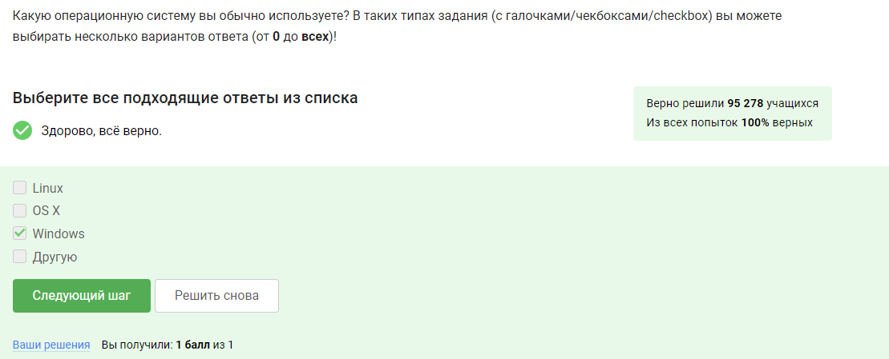
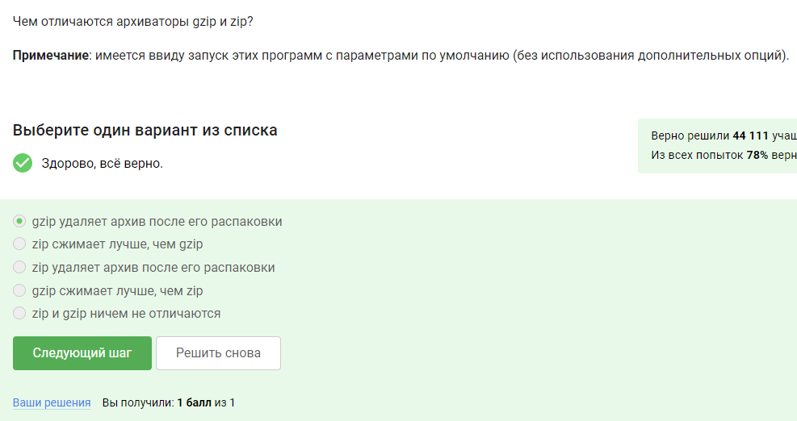

---
## Front matter
title: "Внешний курс"
subtitle: "Введение"
author: "Богданюк Анна Васильевна НКАбд-01-23"

## Generic otions
lang: ru-RU
toc-title: "Содержание"

## Bibliography
bibliography: bib/cite.bib
csl: pandoc/csl/gost-r-7-0-5-2008-numeric.csl

## Pdf output format
toc: true # Table of contents
toc-depth: 2
lof: true # List of figures
lot: true # List of tables
fontsize: 12pt
linestretch: 1.5
papersize: a4
documentclass: scrreprt
## I18n polyglossia
polyglossia-lang:
  name: russian
  options:
	- spelling=modern
	- babelshorthands=true
polyglossia-otherlangs:
  name: english
## I18n babel
babel-lang: russian
babel-otherlangs: english
## Fonts
mainfont: DejaVuSerif
romanfont: DejaVuSerif
sansfont: DejaVuSans
monofont: DejaVuSansMono
mainfontoptions: Ligatures=TeX
romanfontoptions: Ligatures=TeX
sansfontoptions: Ligatures=TeX,Scale=MatchLowercase
monofontoptions: Scale=MatchLowercase,Scale=0.9
## Biblatex
biblatex: true
biblio-style: "gost-numeric"
biblatexoptions:
  - parentracker=true
  - backend=biber
  - hyperref=auto
  - language=auto
  - autolang=other*
  - citestyle=gost-numeric
## Pandoc-crossref LaTeX customization
figureTitle: "Рис."
tableTitle: "Таблица"
listingTitle: "Листинг"
lofTitle: "Список иллюстраций"
lotTitle: "Список таблиц"
lolTitle: "Листинги"
## Misc options
indent: true
header-includes:
  - \usepackage{indentfirst}
  - \usepackage{float} # keep figures where there are in the text
  - \floatplacement{figure}{H} # keep figures where there are in the text
---

# Цель работы

Целью работы является получение базовых знаний о Linux.

# Задание

1. Изучить теоритический материал
2. Пройти тесты

# Выполнение лабораторной работы

Начинаю курс с ответа на пробные вопросы (рис. [-@fig:001]).

{#fig:001 width=70%}

Начинаю курс с ответа на пробные вопросы (рис. [-@fig:002]).

{#fig:002 width=70%}

Я использую Windows (рис. [-@fig:003]).

{#fig:003 width=70%}

Виртуальная машина - Специальная программа для запуска одной ОС на другой ОС (рис. [-@fig:004]).

{#fig:004 width=70%}

Отвечаю Да, т.к. я смогла запустить Linux на моем компьютере (рис. [-@fig:005]).

{#fig:005 width=70%}

Расширение deb имеют установочные пакеты в Linux (Ubuntu) (рис. [-@fig:006]).

{#fig:006 width=70%}

Запускаю VLC, открываю Help → About (или Shift+F1) и пишу первую фамилию из вкладки Authors. Это Denis-Courmont (рис. [-@fig:007]).

{#fig:007 width=70%}

Приложение Update Manager используется для обновления установленных программ, для обновления ссылок в Software Center, для обновления всей системы до новой версии (рис. [-@fig:008]).

{#fig:008 width=70%}

Синонимы для “командной строки”: Консоль, терминал (рис. [-@fig:009]).

{#fig:009 width=70%}

Только pwd, т.к. линукс чувствителен к регистру (рис. [-@fig:010]).

{#fig:010 width=70%}

В последнем варианте нет тире, поэтому не подходит. Первый не подходит, т.к. для команды "ls" не существует опции "--list" (рис. [-@fig:011]).

{#fig:011 width=70%}

Данное задание просто проверить на практике. Нужно прописать полный путь до директории Downloads, так как на данный момент нахожусь в другой директории. (рис. [-@fig:012]).

{#fig:012 width=70%}

mkdir по определение не подходит, rm -r правильно, т.к. -r используется для удаление директорий (рис. [-@fig:013]).

{#fig:013 width=70%}

Проверила на практике, не закроется ничего (рис. [-@fig:014]).

{#fig:014 width=70%}

Ctrl+Z останавливает, bg - переводит в фоновый режим (рис. [-@fig:015]).

{#fig:015 width=70%}

Создала файл с программой, сделала его исполняемым, запустила. Результат вывела (рис. [-@fig:016]).

{#fig:016 width=70%}

Ошибка идёт в stderr, а он по умолчанию на экран выводится (рис. [-@fig:017]).

{#fig:017 width=70%}

programma 2> file program 2>> file.txt- Перенаправить стандартный поток ошибок в файл. Если файл не существует, он будет создан, если существовал, то будет перезаписан. (рис. [-@fig:018]).

{#fig:018 width=70%}

cat names.txt | ./interacter.py | less = вывод на экран, cat names.txt | ./interacter.py 2>err.txt | less = вывод ошибки в err.txt (рис. [-@fig:019]).

{#fig:019 width=70%}

Просто проверить на практике. Команда wget -P /home/alex/Pictures http://example.com/example.jpg скачивает файл и размещает его, назвав example.jpg, в папке /home/alex/Pictures. Но после этих манипуляций срабатывает часть ключа -O 1.jpg и только что скачаный example.jpg конвертируется в 1.jpg и размещается в текущей директории, в которой мы находимся (рис. [-@fig:020]).

{#fig:020 width=70%}

-q или --quiet = без сообщений (рис. [-@fig:021]).

{#fig:021 width=70%}

wget скачивает указанный вами тип файлов, а так же промежуточные HTML, INDEX и другие файлы. wget удалит все файлы, не относящиеся к указанному типу (рис. [-@fig:022]).

{#fig:022 width=70%}

gzip (сокращение от GNU Zip) — утилита сжатия и восстановления (декомпрессии) файлов, использующая алгоритм Deflate (рис. [-@fig:023]).

{#fig:023 width=70%}

tar - архиватор, gzip - компрессор, zip - архиватор и компрессор (рис. [-@fig:024]).

{#fig:024 width=70%}

c - чтобы заархирвировать, j - для использования имено архиватора bzip, f - потому что создаем архив в файловой системе (рис. [-@fig:025]).

{#fig:025 width=70%}

Linux чувствителен к регистру, * - это сколько угодно символов, ? – это один символ, разное расширение файлов (рис. [-@fig:026]).

{#fig:026 width=70%}

world и word - разные слова, Linux чувствителен к регистру (т.к. команда просто grep без -i)(рис. [-@fig:027]).

{#fig:027 width=70%}

Делаю это задание и отправляю на проверку. Использую команду grep "love" Shakespeare/'<name of play.txt>' > result.txt (рис. [-@fig:028]).

{#fig:028 width=70%}

# Выводы

Во время выполнения внешнего курса я получила базовые знания о Linux.

<!-- # Список литературы{.unnumbered}

::: {#refs}
::: --> 