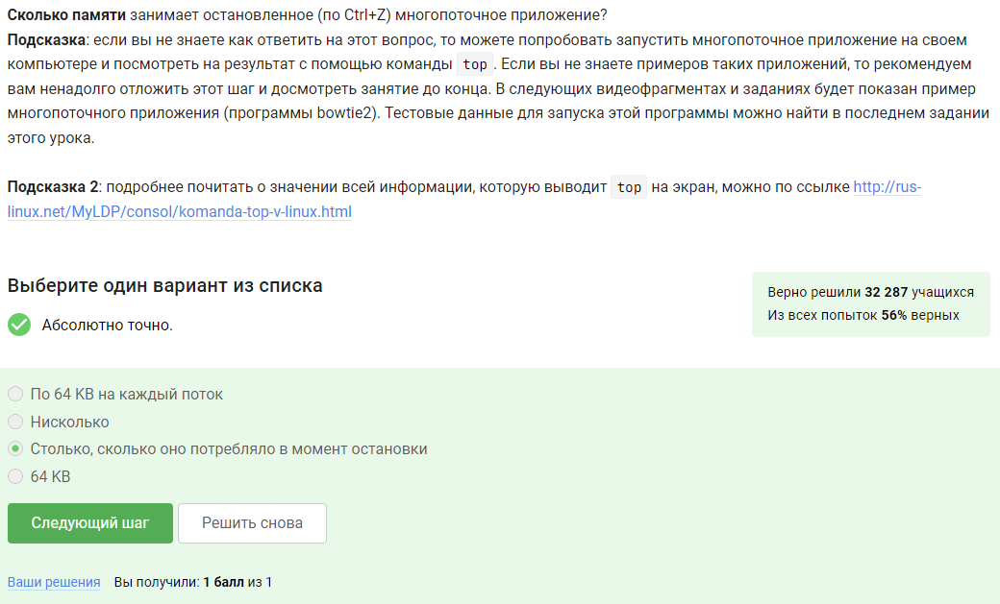

---
## Front matter
title: "Внешний курс"
subtitle: "Работа на сервере"
author: "Богданюк Анна Васильевна НКАбд-01-23"

## Generic otions
lang: ru-RU
toc-title: "Содержание"

## Bibliography
bibliography: bib/cite.bib
csl: pandoc/csl/gost-r-7-0-5-2008-numeric.csl

## Pdf output format
toc: true # Table of contents
toc-depth: 2
lof: true # List of figures
lot: true # List of tables
fontsize: 12pt
linestretch: 1.5
papersize: a4
documentclass: scrreprt
## I18n polyglossia
polyglossia-lang:
  name: russian
  options:
	- spelling=modern
	- babelshorthands=true
polyglossia-otherlangs:
  name: english
## I18n babel
babel-lang: russian
babel-otherlangs: english
## Fonts
mainfont: DejaVuSerif
romanfont: DejaVuSerif
sansfont: DejaVuSans
monofont: DejaVuSansMono
mainfontoptions: Ligatures=TeX
romanfontoptions: Ligatures=TeX
sansfontoptions: Ligatures=TeX,Scale=MatchLowercase
monofontoptions: Scale=MatchLowercase,Scale=0.9
## Biblatex
biblatex: true
biblio-style: "gost-numeric"
biblatexoptions:
  - parentracker=true
  - backend=biber
  - hyperref=auto
  - language=auto
  - autolang=other*
  - citestyle=gost-numeric
## Pandoc-crossref LaTeX customization
figureTitle: "Рис."
tableTitle: "Таблица"
listingTitle: "Листинг"
lofTitle: "Список иллюстраций"
lotTitle: "Список таблиц"
lolTitle: "Листинги"
## Misc options
indent: true
header-includes:
  - \usepackage{indentfirst}
  - \usepackage{float} # keep figures where there are in the text
  - \floatplacement{figure}{H} # keep figures where there are in the text
---

# Цель работы

Целью работы является получение знаний о работе на сервере.

# Задание

1. Изучить теоритический материал
2. Пройти тесты

# Выполнение лабораторной работы

Удаленный сервер используется для хранения больших объемов данных, выполнения сложных (затратных по памяти и времени) вычислений, хранения конфиденциальных данных, хранения общедоступных данных (рис. [-@fig:001]).

{#fig:001 width=70%}

id_rsa.pub, однако правильным ответом был бы "Ни один нельзя"  (рис. [-@fig:002]).

{#fig:002 width=70%}

Можно прочитать manual scp. -r Recursively copy entire directoriesю -p не подходит (рис. [-@fig:003]).

{#fig:003 width=70%}

sudo apt-get upgrade не подходит, т.к. upgrade обновляет пакеты до последних версий и устанавливает новые пакеты, если они требуются в качестве зависимостей. sudo apt-get install --only-upgrade program тоже не поможет (рис. [-@fig:004]).

{#fig:004 width=70%}

Filezilla используется для копирования файлов с сервера на свой компьютер, просмотра содержимого директорий на своем компьютере, просмотра содержимого директорий на сервере (рис. [-@fig:005]).

{#fig:005 width=70%}

Ничешо сделать нельзя и запустить на своем компьютере не подходят очевидно (рис. [-@fig:006]).

{#fig:006 width=70%}

К сожалению, program ?! не походит. Остальные варианты рабочие (рис. [-@fig:007]).

{#fig:007 width=70%}

В справке о FastQC написаны форматы данных: bam_mapped, sam_mapped, fastq, bam,sam (рис. [-@fig:008]).

{#fig:008 width=70%}

Достаточно простой синтаксис. Единственное добавление -align (Do full !multiple alignment!) (рис. [-@fig:009]).

{#fig:009 width=70%}

Комбинация Ctrl+С - завершает процесса, комбинация Ctrl+Z - приостанавливает процесса. Поэтому только о 2 и 3 программе (рис. [-@fig:010]).

{#fig:010 width=70%}

ps и top выводят номер процесса - его PID (process identificator), это такой номер, который присваивается процессу самой ОС, когда процесс запускается. А jobs присваивает процессам свою нумерацию - по порядку запуска процессов. (рис. [-@fig:011]).

{#fig:011 width=70%}

В справочнике kill написано, что -9 мгновенно завершает работу/убивает  (рис. [-@fig:012]).

{#fig:012 width=70%}

Из того же справочника, процесс приступит к завершению, как только будет продолжен (рис. [-@fig:013]).

{#fig:013 width=70%}

Запущенная программа потребляет ресурсы CPU, а остановленная нет. (рис. [-@fig:014]).

{#fig:014 width=70%}

Приостановленное приложение не выполняет новых действий, поэтому не занимает вычислительные ресурсы компьютера (CPU 0%). При этом, в оперативной памяти оно сохранится, поэтому оно будет занимать столько же оперативной памяти, сколько до постановки на паузу. (рис. [-@fig:015]).

{#fig:015 width=70%}

Никак (рис. [-@fig:016]).

{#fig:016 width=70%}

Только bowtie2, однако ответ оба (рис. [-@fig:017]).

{#fig:017 width=70%}

Терминал сообщит, что нет процесса для запуска в fg (рис. [-@fig:018]).

{#fig:018 width=70%}

tmux завершит работу после exit (рис. [-@fig:019]).

{#fig:019 width=70%}

Соединение с сервером прервется, но работа tmux продолжится (рис. [-@fig:020]).

{#fig:020 width=70%}

Вкладка закроется, а вместе с ней пропадет и запущенный в ней процесс (рис. [-@fig:021]).

{#fig:021 width=70%}

Ctrl+b 0-9 - открыть окно по его номеру; Ctrl+b , - переименовать текущее окно; (рис. [-@fig:022]).

{#fig:022 width=70%}

Данное задание легко понять на практике. Команды-"разделения" действуют только в текущей вкладке tmux, а не во всех вкладках одновременно. Если разделенную горизонтально вкладку разделить еще и вертикально (т.е. нажать один раз Ctrl+B и %), то получится 3 "части" -- две маленькие и одна большая (рис. [-@fig:023]).

{#fig:023 width=70%}

# Выводы

Во время выполнения внешнего курса я получила знания о работе на сервере.

<!-- # Список литературы{.unnumbered}

::: {#refs}
::: -->