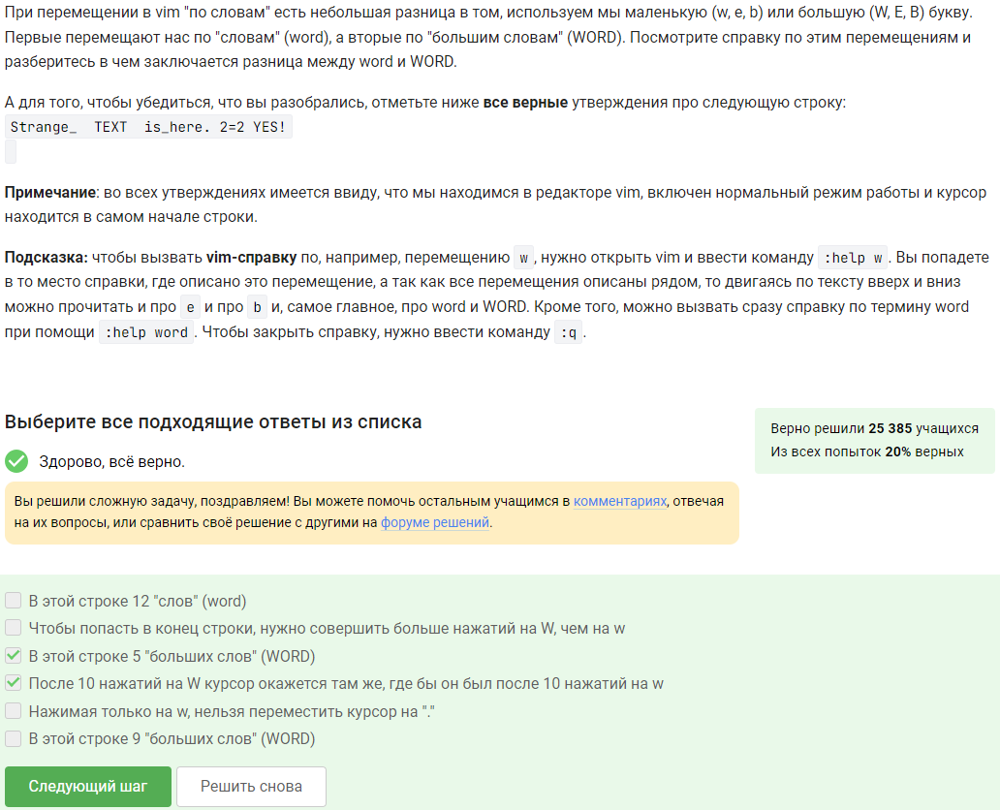

---
## Front matter
title: "Внешний курс"
subtitle: "Продвинутые темы"
author: "Богданюк Анна Васильевна НКАбд-01-23"

## Generic otions
lang: ru-RU
toc-title: "Содержание"

## Bibliography
bibliography: bib/cite.bib
csl: pandoc/csl/gost-r-7-0-5-2008-numeric.csl

## Pdf output format
toc: true # Table of contents
toc-depth: 2
lof: true # List of figures
lot: true # List of tables
fontsize: 12pt
linestretch: 1.5
papersize: a4
documentclass: scrreprt
## I18n polyglossia
polyglossia-lang:
  name: russian
  options:
	- spelling=modern
	- babelshorthands=true
polyglossia-otherlangs:
  name: english
## I18n babel
babel-lang: russian
babel-otherlangs: english
## Fonts
mainfont: DejaVuSerif
romanfont: DejaVuSerif
sansfont: DejaVuSans
monofont: DejaVuSansMono
mainfontoptions: Ligatures=TeX
romanfontoptions: Ligatures=TeX
sansfontoptions: Ligatures=TeX,Scale=MatchLowercase
monofontoptions: Scale=MatchLowercase,Scale=0.9
## Biblatex
biblatex: true
biblio-style: "gost-numeric"
biblatexoptions:
  - parentracker=true
  - backend=biber
  - hyperref=auto
  - language=auto
  - autolang=other*
  - citestyle=gost-numeric
## Pandoc-crossref LaTeX customization
figureTitle: "Рис."
tableTitle: "Таблица"
listingTitle: "Листинг"
lofTitle: "Список иллюстраций"
lotTitle: "Список таблиц"
lolTitle: "Листинги"
## Misc options
indent: true
header-includes:
  - \usepackage{indentfirst}
  - \usepackage{float} # keep figures where there are in the text
  - \floatplacement{figure}{H} # keep figures where there are in the text
---

# Цель работы

Целью работы является получение знания по продвинутым темам по Linux.

# Задание

1. Изучить теоритический материал
2. Пройти тесты

# Выполнение лабораторной работы

q - quit. Чтобы выйти из vim (рис. [-@fig:001]).

{#fig:001 width=70%}

В этой строке 5 "больших слов", потому что в Strange_  TEXT  is_here. 2=2 YES! их 5. После 10 нажатий на W курсор окажется там же, где бы он был после 10 нажатий на w, это можно проверить на практике  (рис. [-@fig:002]).

{#fig:002 width=70%}

Для замены во всем файле можно использовать символ '%'. Vim provides the :s (substitute) command for search and replace (рис. [-@fig:003]).

{#fig:003 width=70%}

В режиме выделения можно использовать команды d (удалить) и y (скопировать). Выйти из режима выделения можно, нажав клавишу Esc два раза. Режим выделения открывается из нормального режима по нажатию "v" . В режиме выделения можно использовать команды перемещения (например, W, e, $, и др.). Когда вы находитесь в режиме выделения, внизу редактора горит надпись -- VISUAL -- (или -- ВИЗУАЛЬНЫЙ РЕЖИМ --) (рис. [-@fig:004]).

{#fig:004 width=70%}

Только из набора С, т.к. у каждой оболочки свой буфер, который при выходе из нее буде записываться в файл истории (рис. [-@fig:005]).

{#fig:005 width=70%}

Можно проверить на практике, хотя все достаточно очевидно. file.txt создается в /home/bi/ (рис. [-@fig:006]).

{#fig:006 width=70%}

Не может начинаться с цифры, но может начинаться с символа, точек быть не может (рис. [-@fig:007]).

{#fig:007 width=70%}

Две переменные (var1=$1, var2=$2) и печать сообщения echo. (рис. [-@fig:008]).

{#fig:008 width=70%}

Все подходят, проверено на практике  (рис. [-@fig:009]).

{#fig:009 width=70%}

Проверено на практике, можно вручную посмотреть. Сначала four, потом four (рис. [-@fig:010]).

{#fig:010 width=70%}

Запустила программу, результат 5 раз "start" и 4 раза "finish" (рис. [-@fig:011]).

{#fig:011 width=70%}

В последнем порядок =+, что неправильно, должно быть +=. В 3 и 4 нет let  (рис. [-@fig:012]).

{#fig:012 width=70%}

/home/bi, т.е. используется pwd, т.к. в коде написано "`pwd`" с косыми кавычками (рис. [-@fig:013]).

{#fig:013 width=70%}

Проверено на практике (рис. [-@fig:014]).

{#fig:014 width=70%}

Первая переменная локальная, поэтому будет пустая строка, вторая -- сумма арифметической прогрессии от 1 до 10 (55), но еще умноженная на 2, т.е. 110 (рис. [-@fig:015]).

{#fig:015 width=70%}

-iname значит, что большая и маленькая буква - не важно. Также star должно стоять в начале названия файла (рис. [-@fig:016]).

{#fig:016 width=70%}

В справочнике по find можно найти ответ. Если заменить в команде поиска -name, на -path, то результат поиска иногда может остаться таким же. В некоторых случаях find с -name найдет больше файлов, чем find с таким же запросом, но с -path (рис. [-@fig:017]).

{#fig:017 width=70%}

Текущий каталог - это depth=1, а остальное считается просто: /home/bi -> depth=1, /home/bi/dir1 -> depth=2, /home/bi/dir1/dir2 -> depth=3 (рис. [-@fig:018]).

{#fig:018 width=70%}

-A num --after-context=num, -B num --before-context=num, -C num -num --context=num (рис. [-@fig:019]).

{#fig:019 width=70%}

Все, что заканчивается buntu подходит (рис. [-@fig:020]).

{#fig:020 width=70%}

The -n option disables the automatic printing, which means the lines you don’t specifically tell it to print do not get printed, and lines you do explicitly tell it to print (e.g. with p) get printed only once.  (рис. [-@fig:021]).

{#fig:021 width=70%}

У sed опция -r, пробелы в [], применить к 2 и более буквам, в конце /g  (рис. [-@fig:022]).

{#fig:022 width=70%}

The persist option tells gnuplot to leave these windows open when the main program exits (рис. [-@fig:023]).

{#fig:023 width=70%}

Название -- первое значение из второго столбца, нарисовано 9 точек (точка из первой строки пропущена) (рис. [-@fig:024]).

{#fig:024 width=70%}

set xtics ("point 1, value ".x1 x1, "point 2, value ".x2 x2, "point 3, value ".x3 x3) (рис. [-@fig:025]).

{#fig:025 width=70%}

a=a+1 zrot=(zrot+350)%360 set view xrot,zrot splot -x**2-y**2 pause 0.1 if (a<50) reread (рис. [-@fig:026]).

{#fig:026 width=70%}

Из  r--r--r-- получить rwxrw-r--. Первый будет rwxrwxrwx. Третий r--r--r-- (рис. [-@fig:027]).

{#fig:027 width=70%}

Сменить права гостей, добавив W, сделать владельцем нужную группу или пользователя, в зависимости от того, у кого из них уже есть права на W, root - владелец и остальные для него - others. (рис. [-@fig:028]).

{#fig:028 width=70%}

wc stands for word count. As the name implies, it is mainly used for counting purpose. It is used to find out number of lines, word count, byte and characters count in the files specified in the file arguments (рис. [-@fig:029]).

{#fig:029 width=70%}

# Выводы

Во время выполнения внешнего курса я получила знания по продвинутым темам по Linux.

<!-- # Список литературы{.unnumbered}

::: {#refs}
::: -->