---
## Front matter
lang: ru-RU
title: Лабораторная работа №4
subtitle: Операционные системы
author:
  - Богданюк А.В., НКАбд-01-22
institute:
  - Российский университет дружбы народов, Москва, Россия
date: 09 марта 2024

## i18n babel
babel-lang: russian
babel-otherlangs: english

## Formatting pdf
toc: false
toc-title: Содержание
slide_level: 2
aspectratio: 169
section-titles: true
theme: metropolis
header-includes:
 - \metroset{progressbar=frametitle,sectionpage=progressbar,numbering=fraction}
 - '\makeatletter'
 - '\beamer@ignorenonframefalse'
 - '\makeatother'
---

## Цель работы

Целью данной работы является Получение навыков правильной работы с репозиториями git.

## Задание

1. Установка программного обеспечения
2. Установка git-flow
3. Установка Node.js
4. Настройка Node.js
5. Общепринятые коммиты

## Выполнение лабораторной работы

Для того, чтобы установить необходимое программное обеспечени, сначала скачаю обновленённые версии пакетов (рис. 1).

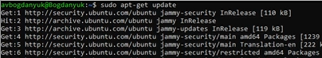{#fig:001 width=60%}

## Выполнение лабораторной работы

Затем уже устанавливаю git-flow (рис. 2).

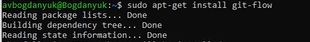{#fig:002 width=60%}

## Выполнение лабораторной работы

Теперь необходимо установить Node.js. На Node.js базируется программное обеспечение для семантического версионирования и общепринятых коммитов. (рис. 3).

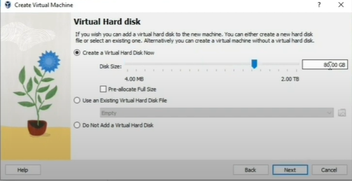{#fig:003 width=70%}

## Выполнение лабораторной работы

Затем подгружаю pnpm (рис. 4).

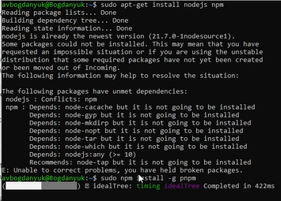{#fig:004 width=70%}

## Выполнение лабораторной работы

Для работы с Node.js добавим каталог с исполняемыми файлами, устанавливаемыми yarn, в переменную PATH (рис. 5).

{#fig:005 width=70%}

## Выполнение лабораторной работы

Выполняю source ~/.bashrc (рис. 6).

{#fig:006 width=70%}

## Выполнение лабораторной работы

Данная программа используется для помощи в форматировании коммитов. При этом устанавливается скрипт git-cz, который мы и будем использовать для коммитов (рис. 7).

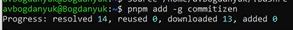{#fig:007 width=70%}

## Выполнение лабораторной работы

Данная программа используется для помощи в создании логов (рис. 8).

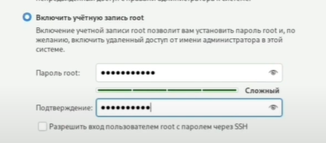{#fig:008 width=70%}

## Выполнение лабораторной работы

Теперь переходим к практическому сценарию использования git. Для начала создаю репозиторий на GitHub git-extended (рис. 9).

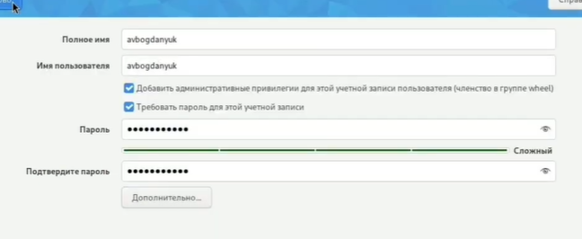{#fig:009 width=70%}

## Выполнение лабораторной работы

Делаем первый коммит и выкладываем на github (рис. 10).

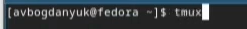{#fig:010 width=70%}

## Выполнение лабораторной работы

Конфигурация для пакетов Node.js (рис. 11).

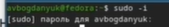{#fig:011 width=70%}

## Выполнение лабораторной работы

Теперь необходимо заполнить несколько параметров пакета. Сконфигурим формат коммитов. Для этого добавим в файл package.json команду для формирования коммитов (рис. 12).

{#fig:012 width=70%}

## Выполнение лабораторной работы

Добавляем новый файл package.json (рис. 13).

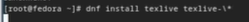{#fig:013 width=70%}

## Выполнение лабораторной работы

Выполняем коммит. Я выбрала тип feat. И отправляем на github (рис. 14).

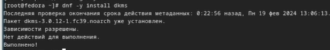{#fig:014 width=70%}

## Выполнение лабораторной работы

Вид моего репозитория на гитхаб (рис. 15).

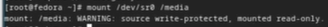{#fig:015 width=70%}

## Выполнение лабораторной работы

Инициализируем git-flow, префикс для ярлыков установим в v (рис. 16).

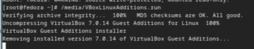{#fig:016 width=70%}

## Выполнение лабораторной работы

Проверяем, что я на ветке develop, все верно (рис. 17).

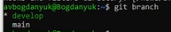{#fig:017 width=70%}

## Выполнение лабораторной работы

Загружаю весь репозиторий в хранилище (рис. 18).

{#fig:018 width=70%}

## Выполнение лабораторной работы

Устанавливаем внешнюю ветку как вышестоящую для этой ветки (рис. 19).

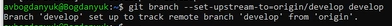{#fig:019 width=70%}

## Выполнение лабораторной работы

Создаем релиз с версией 1.0.0 (рис. 20).

{#fig:020 width=70%}

## Выполнение лабораторной работы

Создаем журнал изменений (рис. 21).

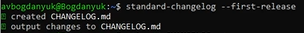{#fig:021 width=70%}

## Выполнение лабораторной работы

Добавим журнал изменений в индекс (рис. 22).

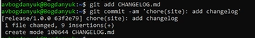{#fig:022 width=70%}

## Выполнение лабораторной работы

Зальём релизную ветку в основную  ветку (рис. 23).

{#fig:023 width=70%}

## Выполнение лабораторной работы

Отправляю данные на github (рис. 24).

{#fig:024 width=70%}

## Выполнение лабораторной работы

Создаю релиз на гитхаб. Для этого использую утилит работы с гитхаб (рис. 25).

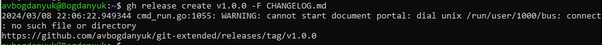{#fig:025 width=70%}

## Выполнение лабораторной работы

Вид моего гитхаба на этот момент выполнения лабораторной. Можео заметить, что появился tag и 2 ветки (рис. 26).

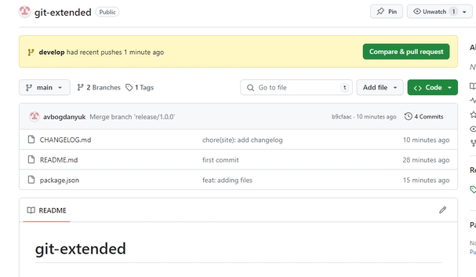{#fig:026 width=70%}

## Выполнение лабораторной работы

Теперь перейдем к работе с репозиторием git. Начнем с разработски новой функциональности. Создаю ветку для новой функциональности (рис. 27).

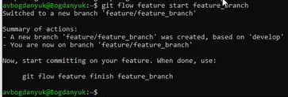{#fig:027 width=70%}

## Выполнение лабораторной работы

Далее, продолжаю работу с гит как обычно. По окончании разработки новой функциональности следующим шагом следует объединить ветку feature_branch c develop (рис. 28).

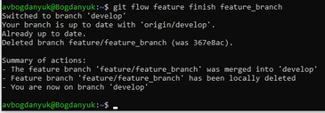{#fig:028 width=70%}

## Выполнение лабораторной работы

Следующий шаг - создание релиза git-flow. Создадим для начала релиз с версией 1.2.3 (рис. 29).

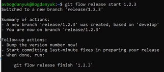{#fig:029 width=70%}

## Выполнение лабораторной работы

Обновляю номер версии в файле package.json. Устанавливаю её в 1.2.3 (рис. 30).

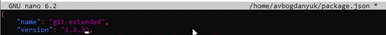{#fig:030 width=70%}

## Выполнение лабораторной работы

Создаю журнал изменений (рис. 31).

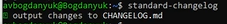{#fig:031 width=70%}

## Выполнение лабораторной работы

Добавляю журнал изменений в индекс (рис. 32).

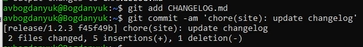{#fig:032 width=70%}

## Выполнение лабораторной работы

Заливаю релизную ветку в основную (рис. 33).

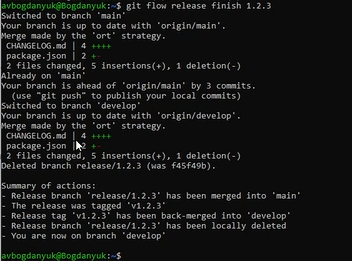{#fig:033 width=70%}

## Выполнение лабораторной работы

Отправляю данных на github (рис. 34).

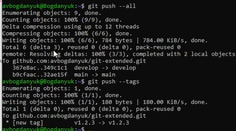{#fig:034 width=70%}

## Выполнение лабораторной работы

Создаю релиз на github с комментарием из журнала изменений (рис. 35).

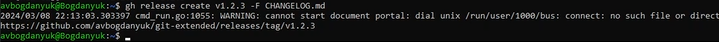{#fig:035 width=70%}

## Список литературы{.unnumbered}

::: {#refs}
1. Dash P. Getting started with oracle vm virtualbox. Packt Publishing Ltd, 2013. 86 p.
2. Colvin H. Virtualbox: An ultimate guide book on virtualization with virtualbox. CreateSpace Independent Publishing Platform, 2015. 70 p.
3. van Vugt S. Red hat rhcsa/rhce 7 cert guide : Red hat enterprise linux 7 (ex200 and ex300). Pearson IT Certification, 2016. 1008 p.
4. Робачевский А., Немнюгин С., Стесик О. Операционная система unix. 2-е изд. Санкт-Петербург: БХВ-Петербург, 2010. 656 p.
5. Немет Э. et al. Unix и Linux: руководство системного администратора. 4-е изд. Вильямс, 2014. 1312 p.
6. Колисниченко Д.Н. Самоучитель системного администратора Linux. СПб.: БХВ-Петербург, 2011. 544 p.
7. Robbins A. Bash pocket reference. O’Reilly Media, 2016. 156 p.
:::