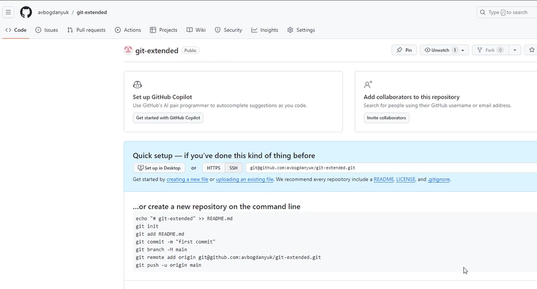
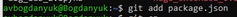
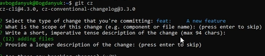
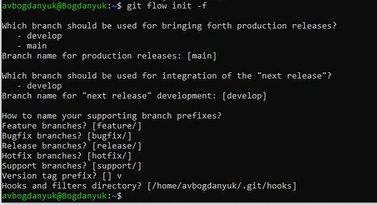

---
## Front matter
lang: ru-RU
title: Лабораторная работа 1
subtitle: Установка и конфигурация операционной системы на виртуальную машину
author:
  - Богданюк А.В.
institute:
  - Российский университет дружбы народов, Москва, Россия

## i18n babel
babel-lang: russian
babel-otherlangs: english

## Formatting pdf
toc: false
toc-title: Содержание
slide_level: 2
aspectratio: 169
section-titles: true
theme: metropolis
header-includes:
 - \metroset{progressbar=frametitle,sectionpage=progressbar,numbering=fraction}
 - '\makeatletter'
 - '\beamer@ignorenonframefalse'
 - '\makeatother'
---

# Вводная часть

## Цель работы

- Целью данной работы является приобретение практических навыков установки операционной системы на виртуальную машину, настройки минимально необходимых для дальнейшей работы сервисов.

## Задание

1. Создание виртуальной машины
2. Установка ОС
3. Установка драйверов для VirtualBox
4. Настройка раскладки клавиатуры
5. Установка имени пользователя и названия хоста
6. Установка программного обеспечения для создания документации
7. Контрольные вопросы

# Основная часть

## Выполнение лабораторной работы

Скачиваю VirtualBox, создаю новую виртуальную машину Linux, Fedora 64-bit (рис. 1).

{#fig:001 width=70%}

## Выполнение лабораторной работы

Указываю размер основной памяти виртуальной машины (рис. 2).

{#fig:002 width=70%}

## Выполнение лабораторной работы
Задаю размер диска - 80 ГБ, создаю новый (рис. 3).

{#fig:003 width=70%}

## Выполнение лабораторной работы

Загружаю новый оптический диск с Fedora Sway (рис. 4).

{#fig:004 width=70%}

## Выполнение лабораторной работы

Включаю ускорения 3D (рис. 5).

{#fig:005 width=70%}

## Выполнение лабораторной работы

Подключаю загрузку с DVD (рис. 6).

{#fig:006 width=70%}

## Выполнение лабораторной работы

Запускаю liveinst, выбираю язык интерфейса и перехожу к настройкам установки ОС (рис. 7).

{#fig:007 width=70%}

## Выполнение лабораторной работы

Устанавливаю имя и пароль для пользователя root (рис. 8).

{#fig:008 width=70%}

## Выполнение лабораторной работы

Устанавливаю имя и пароль для моего пользователя, завершаю установку ОС, перезапускаю машину, отключаю оптический диск (рис. 9).

{#fig:009 width=70%}

## Выполнение лабораторной работы

Запускаю терминальный мультиплексор tmux (рис. 10).

{#fig:010 width=70%}

## Выполнение лабораторной работы

Переключаюсь на роль супер-пользователя (рис. 11).

{#fig:011 width=70%}

## Выполнение лабораторной работы

Для работы с языком разметки Markdown устанавливаю pandoc с помощью меседжера пакетов (рис. 12).

{#fig:012 width=70%}

## Выполнение лабораторной работы

Устанавливаю дистрибутив texlive (рис. 13).

{#fig:013 width=70%}

## Выполнение лабораторной работы

Устанавливаю драйверы: Устанавливаю пакет DKMS (рис. 14).

{#fig:014 width=70%}

## Выполнение лабораторной работы

В меню виртуальной машины подключаю образ диска дополнений гостевой ОС, затем монтирую диск (рис. 15).

{#fig:015 width=70%}

## Выполнение лабораторной работы

Устанавливаю драйвера (рис. 16).

{#fig:016 width=70%}

## Выполнение лабораторной работы

Редактирую конфигурационный файл /etc/X11/xorg.conf.d/00-keyboard.conf (рис. 17).

{#fig:017 width=70%}

## Выполнение лабораторной работы

Обновляю все пакеты (рис. 18).

{#fig:018 width=70%}

## Выполнение лабораторной работы

Для повышения комфорта работы устанавливаю программы для удобства работы в консоли (рис. 19).

{#fig:019 width=70%}

## Выполнение лабораторной работы

При необходимости можно использовать автоматическое обновление, для этого устанавливаю необходимое программное обеспечение (рис. 20).

{#fig:020 width=70%}

## Выполнение лабораторной работы

Задаю необходимую конфигурацию в файле /etc/dnf/automatic.conf и запускаю таймер (рис. 21).

{#fig:021 width=70%}

## Выполнение лабораторной работы

Для того, чтобы отключить SELinux, изменяю в файле /etc/selinux/config SELINUX=enforcing на SELINUX=permissive, затем reboot (рис. 22).

{#fig:022 width=70%}

## Выполнение лабораторной работы

Устанавливаю средства разработки (рис. 23).

{#fig:023 width=70%}

## Выполнение лабораторной работы

Получите следующую информацию: Версия ядра Linux (Linux version), Частота процессора (Detected Mhz processor), Модель процессора (CPU0). (рис. 24).

{#fig:024 width=70%}

## Выполнение лабораторной работы

Получаю информацию: Объём доступной оперативной памяти (Memory available), Тип обнаруженного гипервизора (Hypervisor detected). (рис. 25).

{#fig:025 width=70%}

## Выполнение лабораторной работы

Получаю информацию: Тип файловой системы корневого раздела (рис. 26).

{#fig:026 width=70%}

# Итоговая часть

## Вывод

- В ходе выполнения данной работы были приобретены практические навыки установки операционной системы на виртуальную машину, настройки минимально необходимых для дальнейшей работы сервисов.
