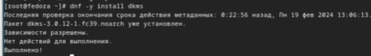
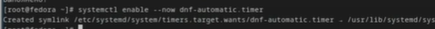

---
## Front matter
title: "Лабораторная работа 1"
subtitle: "Установка и конфигурация операционной системы на виртуальную машину"
author: "Богданюк Анна Васильевна"

## Generic otions
lang: ru-RU
toc-title: "Содержание"

## Bibliography
bibliography: bib/cite.bib
csl: pandoc/csl/gost-r-7-0-5-2008-numeric.csl

## Pdf output format
toc: true # Table of contents
toc-depth: 2
lof: true # List of figures
lot: true # List of tables
fontsize: 12pt
linestretch: 1.5
papersize: a4
documentclass: scrreprt
## I18n polyglossia
polyglossia-lang:
  name: russian
  options:
	- spelling=modern
	- babelshorthands=true
polyglossia-otherlangs:
  name: english
## I18n babel
babel-lang: russian
babel-otherlangs: english
## Fonts
mainfont: PT Serif
romanfont: PT Serif
sansfont: PT Sans
monofont: PT Mono
mainfontoptions: Ligatures=TeX
romanfontoptions: Ligatures=TeX
sansfontoptions: Ligatures=TeX,Scale=MatchLowercase
monofontoptions: Scale=MatchLowercase,Scale=0.9
## Biblatex
biblatex: true
biblio-style: "gost-numeric"
biblatexoptions:
  - parentracker=true
  - backend=biber
  - hyperref=auto
  - language=auto
  - autolang=other*
  - citestyle=gost-numeric
## Pandoc-crossref LaTeX customization
figureTitle: "Рис."
tableTitle: "Таблица"
listingTitle: "Листинг"
lofTitle: "Список иллюстраций"
lotTitle: "Список таблиц"
lolTitle: "Листинги"
## Misc options
indent: true
header-includes:
  - \usepackage{indentfirst}
  - \usepackage{float} # keep figures where there are in the text
  - \floatplacement{figure}{H} # keep figures where there are in the text
---
# Цель работы

Целью данной работы является приобретение практических навыков установки операционной системы на виртуальную машину, настройки минимально необходимых для дальнейшей работы сервисов.

# Задание

1. Создание виртуальной машины
2. Установка ОС
3. Установка драйверов для VirtualBox
4. Настройка раскладки клавиатуры
5. Установка имени пользователя и названия хоста
6. Установка программного обеспечения для создания документации
7. Контрольные вопросы

# Контрольные вопросы

1) Учетная запись содержит: системное имя (user name), идентификатор пользователя (UID) (уникальный идентификатор пользователя в системе, целое положительное число), идентификатор группы (CID), полное имя (full name), домашний каталог, начальная оболочка
2)для получения справки по команде help;
для перемещения по файловой системе cd;
для просмотра содержимого каталога ls;
для определения объёма каталога du;
для создания / удаления каталогов / файлов mkdir/rmdir и touch/rm;
для задания определённых прав на файл / каталог chmod;
для просмотра истории команд history.
3)Файловая система - это порядок, определяющий способ организации и хранения и именования данных на различных носителях информации. 
Примеры: ReFS (Resilient File System)
Copy-on-Write (CoW) – никакие метаданные не изменяются без копирования;
данные записываются на новое дисковое пространство, а не поверх существующих файлов; при модификации метаданных новая копия хранится в свободном дисковом пространстве, затем система создает ссылку из старых метаданных на новую версию.
4)С помощью df и mount.
5)1. Смотрим id процесса с помощью ps 2. kill < id процесса >. 

# Выполнение лабораторной работы

Скачиваю VirtualBox, создаю новую виртуальную машину Linux, Fedora 64-bit (рис. [-@fig:001]).

{#fig:001 width=70%}

Указываю размер основной памяти виртуальной машины (рис. [-@fig:002]).

{#fig:002 width=70%}

Задаю размер диска - 80 ГБ, создаю новый (рис. [-@fig:003]).

{#fig:003 width=70%}

Загружаю новый оптический диск с Fedora Sway (рис. [-@fig:004]).

{#fig:004 width=70%}

Включаю ускорения 3D (рис. [-@fig:005]).

{#fig:005 width=70%}

Подключаю загрузку с DVD (рис. [-@fig:006]).

{#fig:006 width=70%}

Запускаю liveinst, выбираю язык интерфейса и перехожу к настройкам установки ОС (рис. [-@fig:007]).

{#fig:007 width=70%}

Устанавливаю имя и пароль для пользователя root (рис. [-@fig:008]).

{#fig:008 width=70%}

Устанавливаю имя и пароль для моего пользователя, завершаю установку ОС, перезапускаю машину, отключаю оптический диск (рис. [-@fig:009]).

{#fig:009 width=70%}

Запускаю терминальный мультиплексор tmux (рис. [-@fig:010]).

{#fig:010 width=70%}

Переключаюсь на роль супер-пользователя (рис. [-@fig:011]).

{#fig:011 width=70%}

Для работы с языком разметки Markdown устанавливаю pandoc с помощью меседжера пакетов (рис. [-@fig:012]).

{#fig:012 width=70%}

Устанавливаю дистрибутив texlive (рис. [-@fig:013]).

{#fig:013 width=70%}

Устанавливаю драйверы: Устанавливаю пакет DKMS (рис. [-@fig:014]).

{#fig:014 width=70%}

В меню виртуальной машины подключаю образ диска дополнений гостевой ОС, затем монтирую диск (рис. [-@fig:015]).

{#fig:015 width=70%}

Устанавливаю драйвера (рис. [-@fig:016]).

{#fig:016 width=70%}

Редактирую конфигурационный файл /etc/X11/xorg.conf.d/00-keyboard.conf (рис. [-@fig:017]).

{#fig:017 width=70%}

Обновляю все пакеты (рис. [-@fig:018]).

{#fig:018 width=70%}

Для повышения комфорта работы устанавливаю программы для удобства работы в консоли (рис. [-@fig:019]).

{#fig:019 width=70%}

При необходимости можно использовать автоматическое обновление, для этого устанавливаю необходимое программное обеспечение (рис. [-@fig:020]).

{#fig:020 width=70%}

Задаю необходимую конфигурацию в файле /etc/dnf/automatic.conf и запускаю таймер (рис. [-@fig:021]).

{#fig:021 width=70%}

Для того, чтобы отключить SELinux, изменяю в файле /etc/selinux/config SELINUX=enforcing на SELINUX=permissive, затем reboot (рис. [-@fig:022]).

{#fig:022 width=70%}

Устанавливаю средства разработки (рис. [-@fig:023]).

{#fig:023 width=70%}

Получите следующую информацию: Версия ядра Linux (Linux version), Частота процессора (Detected Mhz processor), Модель процессора (CPU0). (рис. [-@fig:024]).

{#fig:024 width=70%}

Получаю информацию: Объём доступной оперативной памяти (Memory available), Тип обнаруженного гипервизора (Hypervisor detected). (рис. [-@fig:025]).

{#fig:025 width=70%}

Получаю информацию: Тип файловой системы корневого раздела (рис. [-@fig:026]).

{#fig:026 width=70%}

# Выводы

В ходе выполнения данной работы были приобретены практические навыки установки операционной системы на виртуальную машину, настройки минимально необходимых для дальнейшей работы сервисов.

<!-- # Список литературы{.unnumbered}

::: {#refs}
::: -->
