---
## Front matter
lang: ru-RU
title: Лабораторная работа 2
subtitle: Первоначальная настройка git
author:
  - Богданюк А.В
institute:
  - Российский университет дружбы народов, Москва, Россия

## i18n babel
babel-lang: russian
babel-otherlangs: english

## Formatting pdf
toc: false
toc-title: Содержание
slide_level: 2
aspectratio: 169
section-titles: true
theme: metropolis
header-includes:
 - \metroset{progressbar=frametitle,sectionpage=progressbar,numbering=fraction}
 - '\makeatletter'
 - '\beamer@ignorenonframefalse'
 - '\makeatother'
---

# Вводная часть

## Цель работы

- Изучить идеологию и применение средств контроля версий. Освоить умения по работе с git.

## Задание

1. Базовая настройка git
2. Создание ssh ключа
3. Верификация коммитов с помощью PGP
4. Проверка коммитов в Git
5. Шаблон рабочего пространства

## Теоретическая часть

Системы контроля версий (Version Control System, VCS) применяются при работе нескольких человек над одним проектом. Обычно основное дерево проекта хранится в локальном или удалённом репозитории, к которому настроен доступ для участников проекта. При внесении изменений в содержание проекта система контроля версий позволяет их фиксировать, совмещать изменения, произведённые разными участниками проекта, производить откат к любой более ранней версии проекта, если это требуется.
В классических системах контроля версий используется централизованная модель, предполагающая наличие единого репозитория для хранения файлов. Выполнение большинства функций по управлению версиями осуществляется специальным сервером. Участник проекта (пользователь) перед началом работы посредством определённых команд получает нужную ему версию файлов. После внесения изменений, пользователь размещает новую версию в хранилище. При этом предыдущие версии не удаляются из центрального хранилища и к ним можно вернуться в любой момент. Сервер может сохранять не полную версию изменённых файлов, а производить так называемую дельта-компрессию — сохранять только изменения между последовательными версиями, что позволяет уменьшить объём хранимых данных.
Системы контроля версий поддерживают возможность отслеживания и разрешения конфликтов, которые могут возникнуть при работе нескольких человек над одним файлом. Можно объединить (слить) изменения, сделанные разными участниками (автоматически или вручную), вручную выбрать нужную версию, отменить изменения вовсе или заблокировать файлы для изменения. В зависимости от настроек блокировка не позволяет другим пользователям получить рабочую копию или препятствует изменению рабочей копии файла средствами файловой системы ОС, обеспечивая таким образом, привилегированный доступ только одному пользователю, работающему с файлом.

# Основная часть

## Выполнение лабораторной работы

Задаю имя и email владельца репозитория (рис. 1).

{#fig:001 width=70%}

## Выполнение лабораторной работы

Настраиваю utf-8  в выводе сообщений git (рис. 2).

{#fig:002 width=70%}

## Выполнение лабораторной работы

Настраиваю верификацию и подписание коммитов git. Задаю имя начальной ветки (master) (рис. 3).

{#fig:003 width=70%}

## Выполнение лабораторной работы

Устанавливаю параметр autocrlf (рис. 4).

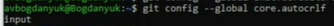{#fig:004 width=70%}

## Выполнение лабораторной работы

Устанавливаю параметр safecrlf (рис. 5).

{#fig:005 width=70%}

## Выполнение лабораторной работы

Создаю ключ ssh по алгоритму rsa с ключём размером 4096 бит (рис. 6).

{#fig:006 width=70%}

## Выполнение лабораторной работы

По алгоритму ed25519 (рис. 7).

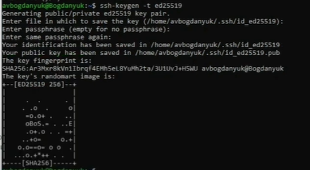{#fig:007 width=70%}

## Выполнение лабораторной работы

Генерируем ключ pgp (рис. 8).

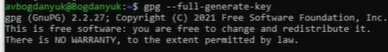{#fig:008 width=70%}

## Выполнение лабораторной работы

Ввожу passphrase, чтобы защитить мой ключ, учетная запись на github осталась с прошлого семестра (рис. 9).

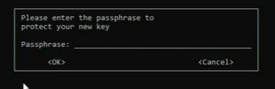{#fig:009 width=70%}

## Выполнение лабораторной работы

Вывожу спислк ключей и копирую отпечаток приватного ключа (рис. 10).

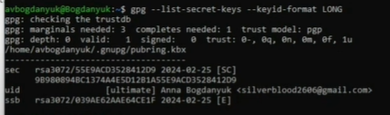{#fig:010 width=70%}

## Выполнение лабораторной работы

Копирую сгенерированный PGP ключ в буфер обмена (рис. 11).

{#fig:011 width=70%}

## Выполнение лабораторной работы

Перехожу в настройки Github, нажимаю на кнопку New GPG key и вставляю полученный ключ в поле ввода (рис. 12).

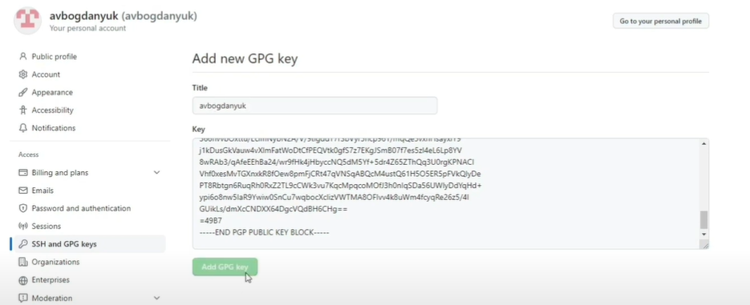{#fig:012 width=70%}

## Выполнение лабораторной работы

Использую введённых email, указываю Git применять его при подписи коммитов (рис. 13).

{#fig:013 width=70%}

## Выполнение лабораторной работы

Устанавливаю gh (рис. 14).

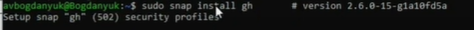{#fig:014 width=70%}

## Выполнение лабораторной работы

Авторизуюсь через браузер (рис. 15).

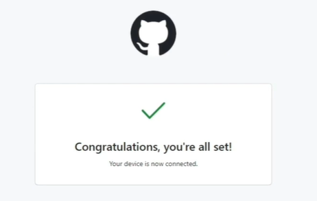{#fig:015 width=70%}

## Выполнение лабораторной работы

Создаю репозироторий курса на основе шаблона (рис. 16).

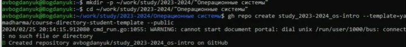{#fig:016 width=70%}

## Выполнение лабораторной работы

Клонирую репозиторий с шаблона (рис. 17).

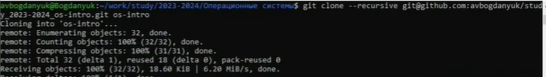{#fig:017 width=70%}

## Выполнение лабораторной работы

Перехожу в каталог курса и удаляю лишний файл (рис. 18).

{#fig:018 width=70%}

## Выполнение лабораторной работы

Создаю необходимые каталоги (рис. 19).

{#fig:019 width=70%}

## Выполнение лабораторной работы

Отправляю файлы на сервер (рис. 20).

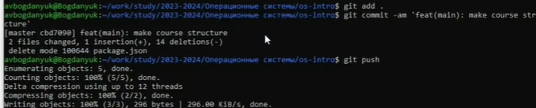{#fig:020 width=70%}

# Заключительная часть

## Вывод

В ходе выполнения лабораторной работы были изучены идеология и применение средств контроля версий и были освоение умения по работе с git.

