---
## Front matter
title: "Лабораторная работы 2"
subtitle: "Первоначальная настройка git"
author: "Богданюк Анна Васильевна"

## Generic otions
lang: ru-RU
toc-title: "Содержание"

## Bibliography
bibliography: bib/cite.bib
csl: pandoc/csl/gost-r-7-0-5-2008-numeric.csl

## Pdf output format
toc: true # Table of contents
toc-depth: 2
lof: true # List of figures
lot: true # List of tables
fontsize: 12pt
linestretch: 1.5
papersize: a4
documentclass: scrreprt
## I18n polyglossia
polyglossia-lang:
  name: russian
  options:
	- spelling=modern
	- babelshorthands=true
polyglossia-otherlangs:
  name: english
## I18n babel
babel-lang: russian
babel-otherlangs: english
## Fonts
mainfont: PT Serif
romanfont: PT Serif
sansfont: PT Sans
monofont: PT Mono
mainfontoptions: Ligatures=TeX
romanfontoptions: Ligatures=TeX
sansfontoptions: Ligatures=TeX,Scale=MatchLowercase
monofontoptions: Scale=MatchLowercase,Scale=0.9
## Biblatex
biblatex: true
biblio-style: "gost-numeric"
biblatexoptions:
  - parentracker=true
  - backend=biber
  - hyperref=auto
  - language=auto
  - autolang=other*
  - citestyle=gost-numeric
## Pandoc-crossref LaTeX customization
figureTitle: "Рис."
tableTitle: "Таблица"
listingTitle: "Листинг"
lofTitle: "Список иллюстраций"
lotTitle: "Список таблиц"
lolTitle: "Листинги"
## Misc options
indent: true
header-includes:
  - \usepackage{indentfirst}
  - \usepackage{float} # keep figures where there are in the text
  - \floatplacement{figure}{H} # keep figures where there are in the text
---

# Цель работы

Изучить идеологию и применение средств контроля версий. Освоить умения по работе с git.

# Задание

1. Базовая настройка git
2. Создание ssh ключа
3. Верификация коммитов с помощью PGP
4. Проверка коммитов в Git
5. Шаблон рабочего пространства

# Теоретическое введение

Системы контроля версий (Version Control System, VCS) применяются при работе нескольких человек над одним проектом. Обычно основное дерево проекта хранится в локальном или удалённом репозитории, к которому настроен доступ для участников проекта. При внесении изменений в содержание проекта система контроля версий позволяет их фиксировать, совмещать изменения, произведённые разными участниками проекта, производить откат к любой более ранней версии проекта, если это требуется.
В классических системах контроля версий используется централизованная модель, предполагающая наличие единого репозитория для хранения файлов. Выполнение большинства функций по управлению версиями осуществляется специальным сервером. Участник проекта (пользователь) перед началом работы посредством определённых команд получает нужную ему версию файлов. После внесения изменений, пользователь размещает новую версию в хранилище. При этом предыдущие версии не удаляются из центрального хранилища и к ним можно вернуться в любой момент. Сервер может сохранять не полную версию изменённых файлов, а производить так называемую дельта-компрессию — сохранять только изменения между последовательными версиями, что позволяет уменьшить объём хранимых данных.
Системы контроля версий поддерживают возможность отслеживания и разрешения конфликтов, которые могут возникнуть при работе нескольких человек над одним файлом. Можно объединить (слить) изменения, сделанные разными участниками (автоматически или вручную), вручную выбрать нужную версию, отменить изменения вовсе или заблокировать файлы для изменения. В зависимости от настроек блокировка не позволяет другим пользователям получить рабочую копию или препятствует изменению рабочей копии файла средствами файловой системы ОС, обеспечивая таким образом, привилегированный доступ только одному пользователю, работающему с файлом.

# Выполнение лабораторной работы

Задаю имя и email владельца репозитория (рис. [-@fig:001]).

{#fig:001 width=70%}

Настраиваю utf-8  в выводе сообщений git (рис. [-@fig:002]).

{#fig:002 width=70%}

Настраиваю верификацию и подписание коммитов git. Задаю имя начальной ветки (master) (рис. [-@fig:003]).

{#fig:003 width=70%}

Устанавливаю параметр autocrlf (рис. [-@fig:004]).

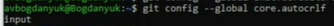{#fig:004 width=70%}

Устанавливаю параметр safecrlf (рис. [-@fig:005]).

{#fig:005 width=70%}

Создаю ключ ssh по алгоритму rsa с ключём размером 4096 бит (рис. [-@fig:006]).

{#fig:006 width=70%}

По алгоритму ed25519 (рис. [-@fig:007]).

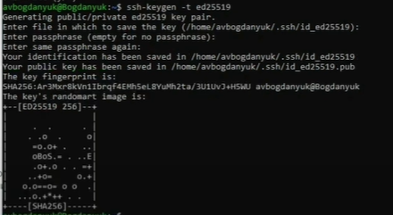{#fig:007 width=70%}

Генерируем ключ pgp (рис. [-@fig:008]).

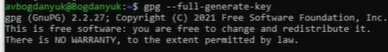{#fig:008 width=70%}

Ввожу passphrase, чтобы защитить мой ключ, учетная запись на github осталась с прошлого семестра (рис. [-@fig:009]).

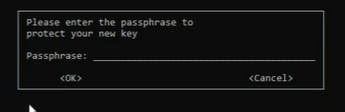{#fig:009 width=70%}

Вывожу спислк ключей и копирую отпечаток приватного ключа (рис. [-@fig:010]).

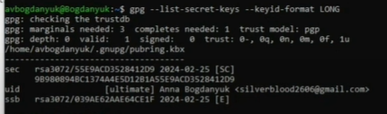{#fig:010 width=70%}

Копирую сгенерированный PGP ключ в буфер обмена (рис. [-@fig:011]).

{#fig:011 width=70%}

Перехожу в настройки Github, нажимаю на кнопку New GPG key и вставляю полученный ключ в поле ввода (рис. [-@fig:012]).

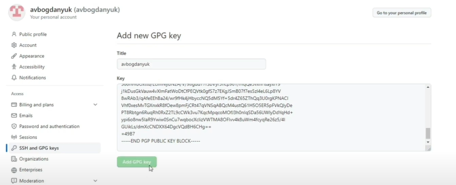{#fig:012 width=70%}

Использую введённых email, указываю Git применять его при подписи коммитов (рис. [-@fig:013]).

{#fig:013 width=70%}

Устанавливаю gh (рис. [-@fig:014]).

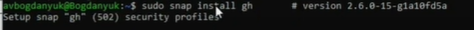{#fig:014 width=70%}

Авторизуюсь через браузер (рис. [-@fig:015]).

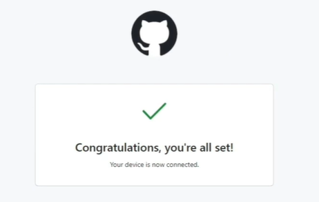{#fig:015 width=70%}

Создаю репозироторий курса на основе шаблона (рис. [-@fig:016]).

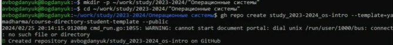{#fig:016 width=70%}

Клонирую репозиторий с шаблона (рис. [-@fig:017]).

{#fig:017 width=70%}

Перехожу в каталог курса и удаляю лишний файл (рис. [-@fig:018]).

{#fig:018 width=70%}

Создаю необходимые каталоги (рис. [-@fig:019]).

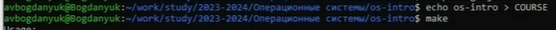{#fig:019 width=70%}

Отправляю файлы на сервер (рис. [-@fig:020]).

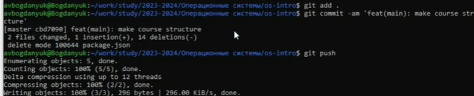{#fig:020 width=70%}

# Выводы

В ходе выполнения лабораторной работы были изучены идеология и применение средств контроля версий и были освоение умения по работе с git.
