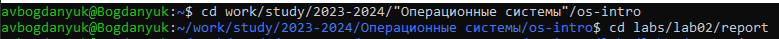
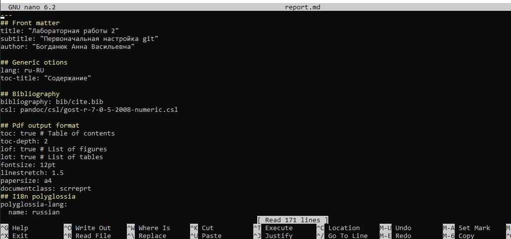
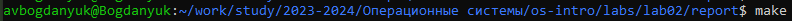
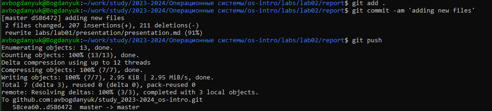

---
## Front matter
lang: ru-RU
title: Лабораторная работа 3
subtitle: Markdown
author:
  - Богданюк А.В.
institute:
  - Российский университет дружбы народов, Москва, Россия

## i18n babel
babel-lang: russian
babel-otherlangs: english

## Formatting pdf
toc: false
toc-title: Содержание
slide_level: 2
aspectratio: 169
section-titles: true
theme: metropolis
header-includes:
 - \metroset{progressbar=frametitle,sectionpage=progressbar,numbering=fraction}
 - '\makeatletter'
 - '\beamer@ignorenonframefalse'
 - '\makeatother'
---

# Вводная часть

## Цель работы

Научиться оформлять отчёты с помощью легковесного языка разметки Markdown.

## Теоретическая часть

Синтаксис Markdown для встроенной ссылки состоит из части [link text] , представляющей текст гиперссылки, и части (file-name.md) – URL-адреса или имени файла,
на который дается ссылка

Для обработки файлов в формате Markdown будем использовать Pandoc
https://pandoc.org/. Конкретно, нам понадобится программа pandoc ,
pandoc-citeproc https://github.com/jgm/pandoc/releases, pandoc-crossref
https://github.com/lierdakil/pandoc-crossref/releases.

# Основная часть

## Выполнение лабораторной работы

Перехожу в каталог с отчетом лабораторной работы 2 (рис. 1).

{#fig:001 width=70%}

## Выполнение лабораторной работы

Редактирую файл report.md (рис. 2).

{#fig:002 width=70%}

## Выполнение лабораторной работы

Использую make, чтобы сделать pdf и docx (рис. 3).

{#fig:003 width=70%}

## Выполнение лабораторной работы

Отправляю файлы на сервер (рис. 4).

{#fig:004 width=70%}

# Итоговая часть

## Вывод

В ходе выполнения лабораторной работы я научилась оформлять отчёты с помощью легковесного языка разметки Markdown.

