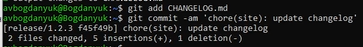

---
## Front matter
title: "Лабораторная работа 4"
subtitle: "Продвинутое использование git"
author: "Богданюк Анна Васильевна"

## Generic otions
lang: ru-RU
toc-title: "Содержание"

## Bibliography
bibliography: bib/cite.bib
csl: pandoc/csl/gost-r-7-0-5-2008-numeric.csl

## Pdf output format
toc: true # Table of contents
toc-depth: 2
lof: true # List of figures
lot: true # List of tables
fontsize: 12pt
linestretch: 1.5
papersize: a4
documentclass: scrreprt
## I18n polyglossia
polyglossia-lang:
  name: russian
  options:
	- spelling=modern
	- babelshorthands=true
polyglossia-otherlangs:
  name: english
## I18n babel
babel-lang: russian
babel-otherlangs: english
## Fonts
mainfont: PT Mono
romanfont: PT Mono
sansfont: PT Mono
monofont: PT Mono
mainfontoptions: Ligatures=TeX
romanfontoptions: Ligatures=TeX
sansfontoptions: Ligatures=TeX,Scale=MatchLowercase
monofontoptions: Scale=MatchLowercase,Scale=0.9
## Biblatex
biblatex: true
biblio-style: "gost-numeric"
biblatexoptions:
  - parentracker=true
  - backend=biber
  - hyperref=auto
  - language=auto
  - autolang=other*
  - citestyle=gost-numeric
## Pandoc-crossref LaTeX customization
figureTitle: "Рис."
tableTitle: "Таблица"
listingTitle: "Листинг"
lofTitle: "Список иллюстраций"
lotTitle: "Список таблиц"
lolTitle: "Листинги"
## Misc options
indent: true
header-includes:
  - \usepackage{indentfirst}
  - \usepackage{float} # keep figures where there are in the text
  - \floatplacement{figure}{H} # keep figures where there are in the text
---

# Цель работы

Получение навыков правильной работы с репозиториями git.

# Задание

1. Установка программного обеспечения
2. Установка git-flow
3. Установка Node.js
4. Настройка Node.js
4. Общепринятые коммиты

# Теоретическое введение

Gitflow Workflow опубликована и популяризована Винсентом Дриссеном.
Gitflow Workflow предполагает выстраивание строгой модели ветвления с учётом выпуска проекта.
Данная модель отлично подходит для организации рабочего процесса на основе релизов.
Работа по модели Gitflow включает создание отдельной ветки для исправлений ошибок в рабочей среде.
Последовательность действий при работе по модели Gitflow:
Из ветки master создаётся ветка develop.
Из ветки develop создаётся ветка release.
Из ветки develop создаются ветки feature.
Когда работа над веткой feature завершена, она сливается с веткой develop.
Когда работа над веткой релиза release завершена, она сливается в ветки develop и master.
Если в master обнаружена проблема, из master создаётся ветка hotfix.
Когда работа над веткой исправления hotfix завершена, она сливается в ветки develop и master.

# Выполнение лабораторной работы

Для того, чтобы установить необходимое программное обеспечени, сначала скачаю обновленённые версии пакето (рис. 1).

{#fig:001 width=70%}

Затем уже устанавливаю git-flow (рис. 2).

{#fig:002 width=70%}

Теперь необходимо установить Node.js. На Node.js базируется программное обеспечение для семантического версионирования и общепринятых коммитов. (рис. 3).

{#fig:003 width=70%}

Затем подгружаю pnpm (рис. 4).

{#fig:004 width=70%}

Для работы с Node.js добавим каталог с исполняемыми файлами, устанавливаемыми yarn, в переменную PATH (рис. 5).

{#fig:005 width=70%}

Выполняю source ~/.bashrc (рис. 6).

{#fig:006 width=70%}

Данная программа используется для помощи в форматировании коммитов. При этом устанавливается скрипт git-cz, который мы и будем использовать для коммитов (рис. 7).

{#fig:007 width=70%}

Данная программа используется для помощи в создании логов (рис. 8).

{#fig:008 width=70%}

Теперь переходим к практическому сценарию использования git. Для начала создаю репозиторий на GitHub git-extended (рис. 9).

{#fig:009 width=70%}

Делаем первый коммит и выкладываем на github (рис. 10).

{#fig:010 width=70%}

Конфигурация для пакетов Node.js (рис. 11).

{#fig:011 width=70%}

Теперь необходимо заполнить несколько параметров пакета. Сконфигурим формат коммитов. Для этого добавим в файл package.json команду для формирования коммитов (рис. 12).

{#fig:012 width=70%}

Добавляем новый файл package.json (рис. 13).

{#fig:013 width=70%}

Выполняем коммит. Я выбрала тип feat. И отправляем на github (рис. 14).

{#fig:014 width=70%}

Вид моего репозитория на гитхаб (рис. 15).

{#fig:015 width=70%}

Инициализируем git-flow, префикс для ярлыков установим в v (рис. 16).

{#fig:016 width=70%}

Проверяем, что я на ветке develop, все верно (рис. 17).

{#fig:017 width=70%}

Загружаю весь репозиторий в хранилище (рис. 18).

{#fig:018 width=70%}

Устанавливаем внешнюю ветку как вышестоящую для этой ветки (рис. 19).

{#fig:019 width=70%}

Создаем релиз с версией 1.0.0 (рис. 20).

{#fig:020 width=70%}

Создаем журнал изменений (рис. 21).

{#fig:021 width=70%}

Добавим журнал изменений в индекс (рис. 22).

{#fig:022 width=70%}

Зальём релизную ветку в основную  ветку (рис. 23).

{#fig:023 width=70%}

Отправляю данные на github (рис. 24).

{#fig:024 width=70%}

Создаю релиз на гитхаб. Для этого использую утилит работы с гитхаб (рис. 25).

{#fig:025 width=70%}

Вид моего гитхаба на этот момент выполнения лабораторной. Можео заметить, что появился tag и 2 ветки (рис. 26).

{#fig:026 width=70%}

Теперь перейдем к работе с репозиторием git. Начнем с разработски новой функциональности. Создаю ветку для новой функциональности (рис. 27).

{#fig:027 width=70%}

Далее, продолжаю работу с гит как обычно. По окончании разработки новой функциональности следующим шагом следует объединить ветку feature_branch c develop (рис. 28).

{#fig:028 width=70%}

Следующий шаг - создание релиза git-flow. Создадим для начала релиз с версией 1.2.3 (рис. 29).

{#fig:029 width=70%}

Обновляю номер версии в файле package.json. Устанавливаю её в 1.2.3 (рис. 30).

{#fig:030 width=70%}

Создаю журнал изменений (рис. 31).

{#fig:031 width=70%}

Добавляю журнал изменений в индекс (рис. 32).

{#fig:032 width=70%}

Заливаю релизную ветку в основную (рис. 33).

{#fig:033 width=70%}

Отправляю данных на github (рис. 34).

{#fig:034 width=70%}

Создаю релиз на github с комментарием из журнала изменений (рис. 35).

{#fig:035 width=70%}

# Выводы

В ходе выполнения лабораторной работы были получены навыки правильной работы с репозиториями git.
