---
## Front matter
lang: ru-RU
title: Лабораторная работа №5
subtitle: Операционные системы
author:
  - Богданюк А.В., НКАбд-01-23
institute:
  - Российский университет дружбы народов, Москва, Россия
date: 09 марта 2024

## i18n babel
babel-lang: russian
babel-otherlangs: english

## Formatting pdf
toc: false
toc-title: Содержание
slide_level: 2
aspectratio: 169
section-titles: true
theme: metropolis
header-includes:
 - \metroset{progressbar=frametitle,sectionpage=progressbar,numbering=fraction}
 - '\makeatletter'
 - '\beamer@ignorenonframefalse'
 - '\makeatother'
---

## Цель работы

Цель данной лабораторной работы -- приобретение практических навыков работы с продвинутым использованием git.

## Задание

1. Менеджер паролей pass
2. Установка
3. Настройка
4. Сохранение пароля
5. Управление файлами конфигурации
6. Дополнительное программное обеспечение

## Выполнение лабораторной работы

Устанавливаю менеджер паролей (рис. 1).

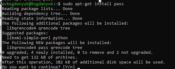{#fig:001 width=70%}

## Выполнение лабораторной работы

Устанавливаю pass-otp (рис. 2).

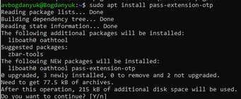{#fig:002 width=70%}

## Выполнение лабораторной работы

Устанавливаю gopass (рис. 3).

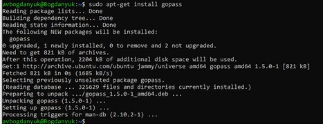{#fig:003 width=70%}

## Выполнение лабораторной работы

Настройка менеджера паролей pass. Просматриваю ключ. Не создаю новый. (рис. 4).

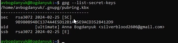{#fig:004 width=70%}

## Выполнение лабораторной работы

Инициализирую хранилище, вставляю gpg-id (рис. 5).

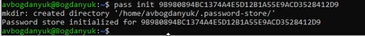{#fig:005 width=70%}

## Выполнение лабораторной работы

Синхронизация менеджера паролей с git. Создаю структуру git (рис. 6).

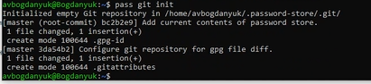{#fig:006 width=70%}

## Выполнение лабораторной работы

Создаю репозиторий lab5 на гитхаб. Задаю адрес репозитория на хостинге (рис. 7).

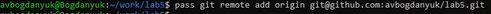{#fig:007 width=70%}

## Выполнение лабораторной работы

Для синхронизации выполняю команды pass git pull, push (рис. 8).

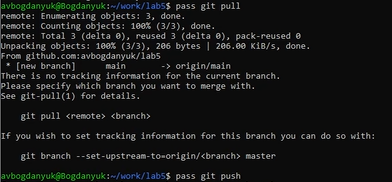{#fig:008 width=70%}

## Выполнение лабораторной работы

Проверяю статус синхронизации (рис. 9).

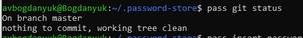{#fig:009 width=70%}

## Выполнение лабораторной работы

Перейдем к пункту сохранения пароля. Добавляю новый пароль. Называю файл, в котором будет хранится пароль password (рис. 10).

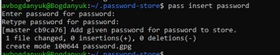{#fig:010 width=70%}

## Выполнение лабораторной работы

Отображаю пароль в файле password - student (рис. 11).

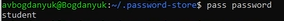{#fig:011 width=70%}

## Выполнение лабораторной работы

Заменяю предыдущий пароль сгенерированым (рис. 12).

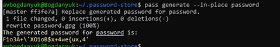{#fig:012 width=70%}

## Выполнение лабораторной работы

Устанавливаю дополнительное программное обеспечение (рис. 13).

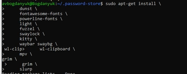{#fig:013 width=70%}

## Выполнение лабораторной работы

Устанавливаю бинарный файл chezmoiс помощью wget (рис. 14).

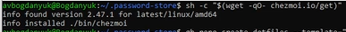{#fig:014 width=70%}

## Выполнение лабораторной работы

Создаю новый репозиторий для конфигурационных файлов на основе шаблона (рис. 15).

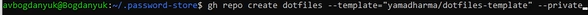{#fig:015 width=70%}

## Выполнение лабораторной работы

Подключение репозитория к своей системе. Инициализация chezmoi с моим репозиторием dotfiles (рис. 16).

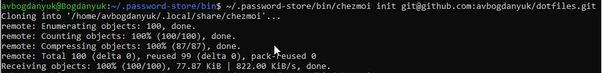{#fig:016 width=70%}

## Выполнение лабораторной работы

Проверяю, какие изменения внесены в chezmoi в домашний каталог (рис. 17).

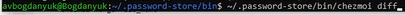{#fig:017 width=70%}

## Выполнение лабораторной работы

Мой репозиторий, созданый на основе шаблона, на гитхаб (рис. 18).

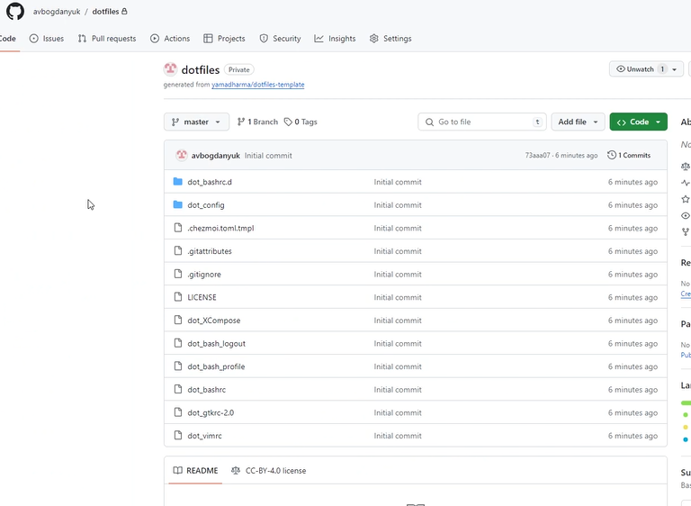{#fig:018 width=70%}

## Выполнение лабораторной работы

Извлекаю изменения из репозитория и применяю их с помощью update. Это запускается git pull --autostash --rebase в вашем исходном каталоге, а затем chezmoi apply (рис. 19).

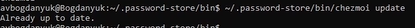{#fig:019 width=70%}

## Выполнение лабораторной работы

Это запускается git pull --autostash --rebase в вашем исходном каталоге, а chezmoi diff затем показывает разницу между целевым состоянием, вычисленным из вашего исходного каталога, и фактическим состоянием (рис. 20).

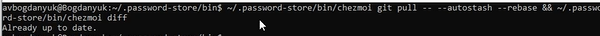{#fig:020 width=70%}

## Выполнение лабораторной работы

Я довольна изменениями, поэтому применяю apply (рис. 21).

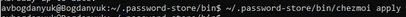{#fig:021 width=70%}

## Выполнение лабораторной работы

Можно автоматически фиксировать и отправлять изменения в исходный каталог в репозиторий. Чтобы включить её, добавьте в файл конфигурации ~/.config/chezmoi/chezmoi.toml следующее: (рис. 22).

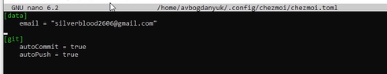{#fig:022 width=70%}

## Список литературы{.unnumbered}

::: {#refs}
1. Dash P. Getting started with oracle vm virtualbox. Packt Publishing Ltd, 2013. 86 p.
2. Colvin H. Virtualbox: An ultimate guide book on virtualization with virtualbox. CreateSpace Independent Publishing Platform, 2015. 70 p.
3. van Vugt S. Red hat rhcsa/rhce 7 cert guide : Red hat enterprise linux 7 (ex200 and ex300). Pearson IT Certification, 2016. 1008 p.
4. Робачевский А., Немнюгин С., Стесик О. Операционная система unix. 2-е изд. Санкт-Петербург: БХВ-Петербург, 2010. 656 p.
5. Немет Э. et al. Unix и Linux: руководство системного администратора. 4-е изд. Вильямс, 2014. 1312 p.
6. Колисниченко Д.Н. Самоучитель системного администратора Linux. СПб.: БХВ-Петербург, 2011. 544 p.
7. Robbins A. Bash pocket reference. O’Reilly Media, 2016. 156 p.
8. Лабораторная работа № 5 [Электронный ресурс] URL: https://esystem.rudn.ru/mod/page/view.php?id=1098796#org2695679
:::