---
## Front matter
title: "Отчет по лабораторной работе №5"
subtitle: "Операционные системы"
author: "Богданюк Анна Васильевна"

## Generic otions
lang: ru-RU
toc-title: "Содержание"

## Bibliography
bibliography: bib/cite.bib
csl: pandoc/csl/gost-r-7-0-5-2008-numeric.csl

## Pdf output format
toc: true # Table of contents
toc-depth: 2
lof: true # List of figures
lot: true # List of tables
fontsize: 12pt
linestretch: 1.5
papersize: a4
documentclass: scrreprt
## I18n polyglossia
polyglossia-lang:
  name: russian
  options:
	- spelling=modern
	- babelshorthands=true
polyglossia-otherlangs:
  name: english
## I18n babel
babel-lang: russian
babel-otherlangs: english
## Fonts
mainfont: PT Serif
romanfont: PT Serif
sansfont: PT Sans
monofont: PT Mono
mainfontoptions: Ligatures=TeX
romanfontoptions: Ligatures=TeX
sansfontoptions: Ligatures=TeX,Scale=MatchLowercase
monofontoptions: Scale=MatchLowercase,Scale=0.9
## Biblatex
biblatex: true
biblio-style: "gost-numeric"
biblatexoptions:
  - parentracker=true
  - backend=biber
  - hyperref=auto
  - language=auto
  - autolang=other*
  - citestyle=gost-numeric
## Pandoc-crossref LaTeX customization
figureTitle: "Рис."
tableTitle: "Таблица"
listingTitle: "Листинг"
lofTitle: "Список иллюстраций"
lotTitle: "Список таблиц"
lolTitle: "Листинги"
## Misc options
indent: true
header-includes:
  - \usepackage{indentfirst}
  - \usepackage{float} # keep figures where there are in the text
  - \floatplacement{figure}{H} # keep figures where there are in the text
---

# Цель работы

Цель данной лабораторной работы -- приобретение практических навыков работы с продвинутым использованием git.

# Задание

1. Менеджер паролей pass
2. Установка
3. Настройка
4. Сохранение пароля
5. Управление файлами конфигурации
6. Дополнительное программное обеспечение

# Выполнение лабораторной работы

Устанавливаю менеджер паролей (рис. 1).

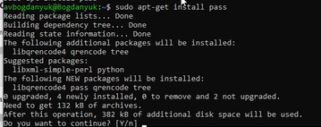{#fig:001 width=70%}

Устанавливаю pass-otp (рис. 2).

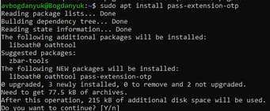{#fig:002 width=70%}

Устанавливаю gopass (рис. 3).

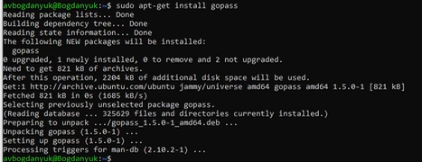{#fig:003 width=70%}

Настройка менеджера паролей pass. Просматриваю ключ. Не создаю новый. (рис. 4).

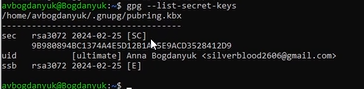{#fig:004 width=70%}

Инициализирую хранилище, вставляю gpg-id (рис. 5).

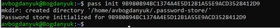{#fig:005 width=70%}

Синхронизация менеджера паролей с git. Создаю структуру git (рис. 6).

{#fig:006 width=70%}

Создаю репозиторий lab5 на гитхаб. Задаю адрес репозитория на хостинге (рис. 7).

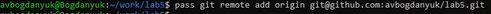{#fig:007 width=70%}

Для синхронизации выполняю команды pass git pull, push (рис. 8).

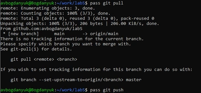{#fig:008 width=70%}

Проверяю статус синхронизации (рис. 9).

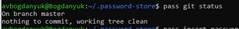{#fig:009 width=70%}

Перейдем к пункту сохранения пароля. Добавляю новый пароль. Называю файл, в котором будет хранится пароль password (рис. 10).

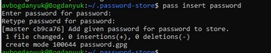{#fig:010 width=70%}

Отображаю пароль в файле password - student (рис. 11).

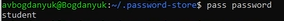{#fig:011 width=70%}

Заменяю предыдущий пароль сгенерированым (рис. 12).

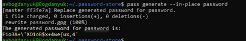{#fig:012 width=70%}

Устанавливаю дополнительное программное обеспечение (рис. 13).

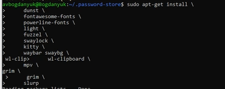{#fig:013 width=70%}

Устанавливаю бинарный файл chezmoiс помощью wget (рис. 14).

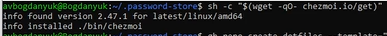{#fig:014 width=70%}

Создаю новый репозиторий для конфигурационных файлов на основе шаблона (рис. 15).

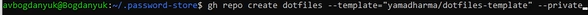{#fig:015 width=70%}

Подключение репозитория к своей системе. Инициализация chezmoi с моим репозиторием dotfiles (рис. 16).

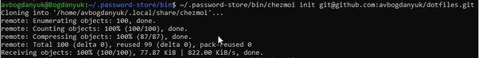{#fig:016 width=70%}

Проверяю, какие изменения внесены в chezmoi в домашний каталог (рис. 17).

{#fig:017 width=70%}

Мой репозиторий, созданый на основе шаблона, на гитхаб (рис. 18).

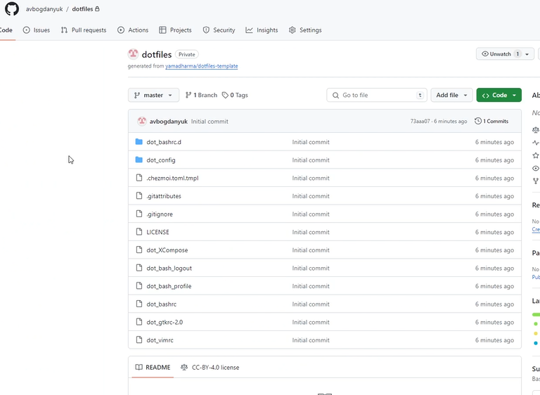{#fig:018 width=70%}

Извлекаю изменения из репозитория и применяю их с помощью update. Это запускается git pull --autostash --rebase в вашем исходном каталоге, а затем chezmoi apply (рис. 19).

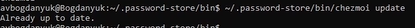{#fig:019 width=70%}

Это запускается git pull --autostash --rebase в вашем исходном каталоге, а chezmoi diff затем показывает разницу между целевым состоянием, вычисленным из вашего исходного каталога, и фактическим состоянием (рис. 20).

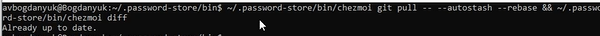{#fig:020 width=70%}

Я довольна изменениями, поэтому применяю apply (рис. 21).

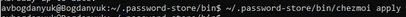{#fig:021 width=70%}

Можно автоматически фиксировать и отправлять изменения в исходный каталог в репозиторий. Чтобы включить её, добавьте в файл конфигурации ~/.config/chezmoi/chezmoi.toml следующее: (рис. 22).

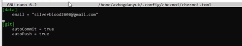{#fig:022 width=70%}

# Выводы

При выполнении данной лабораторной работы я приобрела практические навыки работы с продвинутым использоавние git.

# Список литературы{.unnumbered}

::: {#refs}
1. Лабораторная работа № 5 [Электронный ресурс] URL: https://esystem.rudn.ru/mod/page/view.php?id=1098796#org2695679
:::