---
## Front matter
lang: ru-RU
title: Лабораторная работа №6
subtitle: Основы интерфейса взаимодействия пользователя с системой Unix на уровне командной строки
author:
  - Богданюк А.В., НКАбд-01-23
institute:
  - Российский университет дружбы народов, Москва, Россия
date: 09 марта 2024

## i18n babel
babel-lang: russian
babel-otherlangs: english

## Formatting pdf
toc: false
toc-title: Содержание
slide_level: 2
aspectratio: 169
section-titles: true
theme: metropolis
header-includes:
 - \metroset{progressbar=frametitle,sectionpage=progressbar,numbering=fraction}
 - '\makeatletter'
 - '\beamer@ignorenonframefalse'
 - '\makeatother'
---

## Цель работы

Приобретение практических навыков взаимодействия пользователя с системой посредством командной строки.

## Задание

1. Определите полное имя вашего домашнего каталога.
2. С помощью команды man определите, какую опцию команды ls нужно использовать для просмотра содержимое не только указанного каталога, но и подкаталогов, входящих в него.
3. Используйте команду man для просмотра описания следующих команд: cd, pwd, mkdir, rmdir, rm.
4. Используйте команду man для просмотра описания следующих команд: cd, pwd, mkdir, rmdir, rm.

## Выполнение лабораторной работы

Для того, чтобы определить полное имя домашнего каталога, использую pwd, находясь в home (рис. 1).

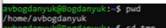{#fig:001 width=70%}

## Выполнение лабораторной работы

Затем перехожу сначала в root, а затем в tmp (рис. 2).

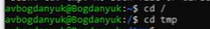{#fig:002 width=70%}

## Выполнение лабораторной работы

Теперь вывожу на экран содержимое этого каталога (рис. 3).

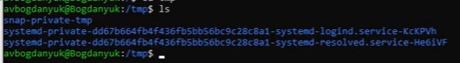{#fig:003 width=70%}

## Выполнение лабораторной работы

Затем использую ls -a, так я вижу скрытые файлы(рис. 4).

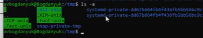{#fig:004 width=70%}

## Выполнение лабораторной работы

Использую ls -alF. Так я вижу и скрытые файлы, и право доступа, и дату последней ревизии (рис. 5).

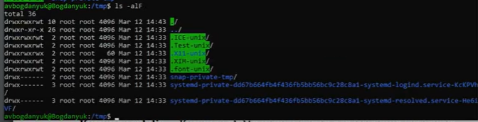{#fig:005 width=70%}

## Выполнение лабораторной работы

Перехожу в каталог /var/spool, с помощью ls определяю наличие cron. Он там есть (рис. 6).

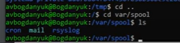{#fig:006 width=70%}

## Выполнение лабораторной работы

Перехожу в домашний каталог. Смотрю его содержимое (рис. 7).

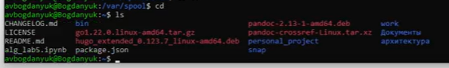{#fig:007 width=70%}

## Выполнение лабораторной работы

С помощью ls -l определяю владельца файлов и подкаталогов. Это avbogdanyuk (рис. 8).

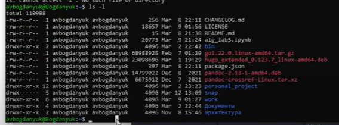{#fig:008 width=70%}

## Выполнение лабораторной работы

Теперь в домашнем каталоге создаю newdir с помощью mkdir (make direcroty) (рис. 9).

{#fig:009 width=70%}

## Выполнение лабораторной работы

В каталоге newdir создаю новый каталог morefun (рис. 10).

{#fig:010 width=70%}

## Выполнение лабораторной работы

С помощью одной команды создаю в домашнем каталоге 3 новых каталога, затем удаляю их разом (рис. 11).

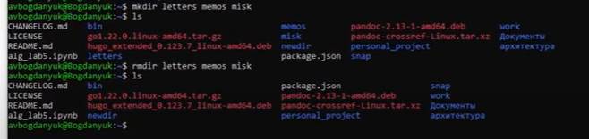{#fig:011 width=70%}

## Выполнение лабораторной работы

Пробую удалить newdir  с помощью rm, однако у меня не получается, т.к. newdir - это каталог (рис. 12).

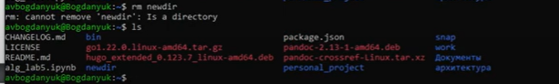{#fig:012 width=70%}

## Выполнение лабораторной работы

Удаляю morefun, находясь в домашнем каталоге. Он действительно был удален (рис. 13).

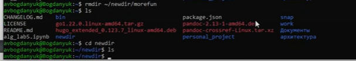{#fig:013 width=70%}

## Выполнение лабораторной работы

С помощью команды man смотрю manual команды ls (рис. 14).

{#fig:014 width=70%}

## Выполнение лабораторной работы

Использую ls -R, чтобы посмотреть не только содержмое каталога, в котором я нахожусь, но и содержимое подкаталогов (рис. 15).

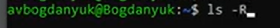{#fig:015 width=70%}

## Выполнение лабораторной работы

Вывод команды ls -R (рис. 16).

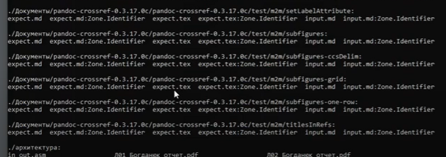{#fig:016 width=70%}

## Выполнение лабораторной работы

Смотрю справочник cd, однако его не существует (рис. 17).

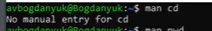{#fig:017 width=70%}

## Выполнение лабораторной работы

Справочник pwd. Используется для вывода имени текущей директории (рис. 18).

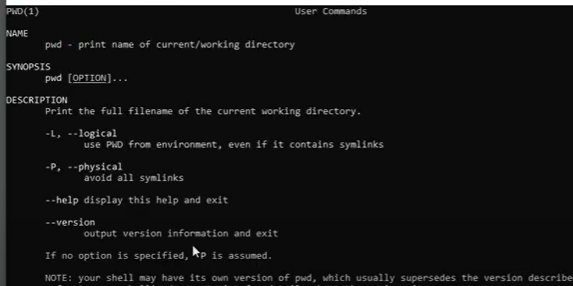{#fig:018 width=70%}

## Выполнение лабораторной работы

Справочник mkdir. Используется для создания каталогов (рис. 19).

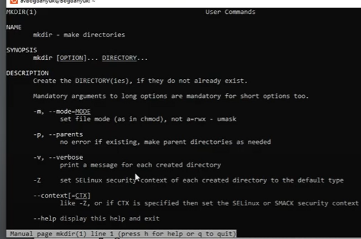{#fig:019 width=70%}

## Выполнение лабораторной работы

Справочник rmdir. Используется для удаления пустых каталогов (рис. 20).

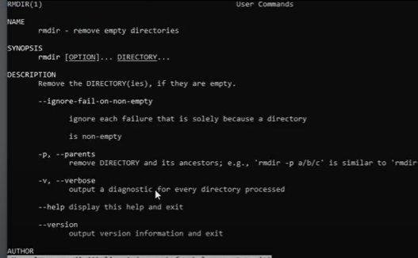{#fig:020 width=70%}

## Выполнение лабораторной работы

Справочник rm. Используется для удаления файлов и директорий (рис. 21).

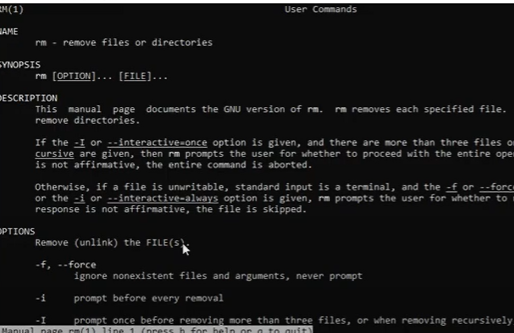{#fig:021 width=70%}

## Выполнение лабораторной работы

Использую команду history. Используется для просмотра истории действий (рис. 22).

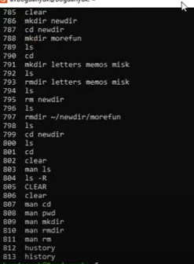{#fig:022 width=70%}

## Выполнение лабораторной работы

Для того, чтобы отсортировать по времени последнего изменения выводимый список содержимого каталогоа с развернутым описание файлов, использую ls -R -t (рис. 23).

{#fig:023 width=70%}

## Выполнение лабораторной работы

Вывод ls -R -t (рис. 24).

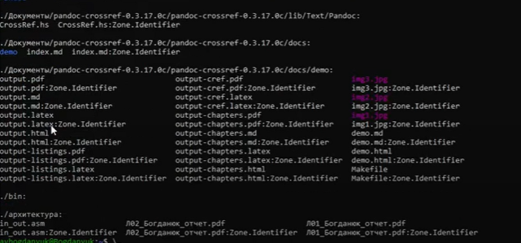{#fig:024 width=70%}

## Выполнение лабораторной работы

Модифицирую историю действий, заменяю одно на другое (рис. 25).

{#fig:025 width=70%}

## Вывод

В ходе выполнения лабораторной работы были приобретены практические навыки взаимодействия пользователя с системой посредством командной строки.

## Список литературы{.unnumbered}

::: {#refs}
1. Dash P. Getting started with oracle vm virtualbox. Packt Publishing Ltd, 2013. 86 p.
2. Colvin H. Virtualbox: An ultimate guide book on virtualization with virtualbox. CreateSpace Independent Publishing Platform, 2015. 70 p.
3. van Vugt S. Red hat rhcsa/rhce 7 cert guide : Red hat enterprise linux 7 (ex200 and ex300). Pearson IT Certification, 2016. 1008 p.
4. Робачевский А., Немнюгин С., Стесик О. Операционная система unix. 2-е изд. Санкт-Петербург: БХВ-Петербург, 2010. 656 p.
5. Немет Э. et al. Unix и Linux: руководство системного администратора. 4-е изд. Вильямс, 2014. 1312 p.
6. Колисниченко Д.Н. Самоучитель системного администратора Linux. СПб.: БХВ-Петербург, 2011. 544 p.
7. Robbins A. Bash pocket reference. O’Reilly Media, 2016. 156 p.
:::