---
## Front matter
title: "Лабораторная работа №6"
subtitle: "Основы интерфейса взаимодействия пользователя с системой Unix на уровне командной строки"
author: "Богданюк Анна Васильевна"

## Generic otions
lang: ru-RU
toc-title: "Содержание"

## Bibliography
bibliography: bib/cite.bib
csl: pandoc/csl/gost-r-7-0-5-2008-numeric.csl

## Pdf output format
toc: true # Table of contents
toc-depth: 2
lof: true # List of figures
lot: true # List of tables
fontsize: 12pt
linestretch: 1.5
papersize: a4
documentclass: scrreprt
## I18n polyglossia
polyglossia-lang:
  name: russian
  options:
	- spelling=modern
	- babelshorthands=true
polyglossia-otherlangs:
  name: english
## I18n babel
babel-lang: russian
babel-otherlangs: english
## Fonts
mainfont: PT Mono
romanfont: PT Mono
sansfont: PT Mono
monofont: PT Mono
mainfontoptions: Ligatures=TeX
romanfontoptions: Ligatures=TeX
sansfontoptions: Ligatures=TeX,Scale=MatchLowercase
monofontoptions: Scale=MatchLowercase,Scale=0.9
## Biblatex
biblatex: true
biblio-style: "gost-numeric"
biblatexoptions:
  - parentracker=true
  - backend=biber
  - hyperref=auto
  - language=auto
  - autolang=other*
  - citestyle=gost-numeric
## Pandoc-crossref LaTeX customization
figureTitle: "Рис."
tableTitle: "Таблица"
listingTitle: "Листинг"
lofTitle: "Список иллюстраций"
lotTitle: "Список таблиц"
lolTitle: "Листинги"
## Misc options
indent: true
header-includes:
  - \usepackage{indentfirst}
  - \usepackage{float} # keep figures where there are in the text
  - \floatplacement{figure}{H} # keep figures where there are in the text
---

# Цель работы

Приобретение практических навыков взаимодействия пользователя с системой посредством командной строки.

# Задание

1. Определите полное имя вашего домашнего каталога. Далее относительно этого каталога будут выполняться последующие упражнения.
2. Выполните следующие действия:
2.1. Перейдите в каталог /tmp.
2.2. Выведите на экран содержимое каталога /tmp. Для этого используйте команду ls
с различными опциями. Поясните разницу в выводимой на экран информации.
2.3. Определите, есть ли в каталоге /var/spool подкаталог с именем cron?
2.4. Перейдите в Ваш домашний каталог и выведите на экран его содержимое. Определите, кто является владельцем файлов и подкаталогов?
3. Выполните следующие действия:
3.1. В домашнем каталоге создайте новый каталог с именем newdir.
3.2. В каталоге ~/newdir создайте новый каталог с именем morefun.
3.3. В домашнем каталоге создайте одной командой три новых каталога с именами
letters, memos, misk. Затем удалите эти каталоги одной командой.
3.4. Попробуйте удалить ранее созданный каталог ~/newdir командой rm. Проверьте,
был ли каталог удалён.
3.5. Удалите каталог ~/newdir/morefun из домашнего каталога. Проверьте, был ли
каталог удалён.
4. С помощью команды man определите, какую опцию команды ls нужно использовать для просмотра содержимое не только указанного каталога, но и подкаталогов,
входящих в него.
5. С помощью команды man определите набор опций команды ls, позволяющий отсортировать по времени последнего изменения выводимый список содержимого каталога
с развёрнутым описанием файлов.
6. Используйте команду man для просмотра описания следующих команд: cd, pwd, mkdir,
rmdir, rm. Поясните основные опции этих команд.
7. Используя информацию, полученную при помощи команды history, выполните модификацию и исполнение нескольких команд из буфера команд.

# Выполнение лабораторной работы

Для того, чтобы определить полное имя домашнего каталога, использую pwd, находясь в home (рис. 1).

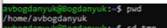{#fig:001 width=70%}

Затем перехожу сначала в root, а затем в tmp (рис. 2).

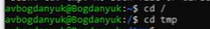{#fig:002 width=70%}

Теперь вывожу на экран содержимое этого каталога (рис. 3).

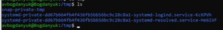{#fig:003 width=70%}

Затем использую ls -a, так я вижу скрытые файлы(рис. 4).

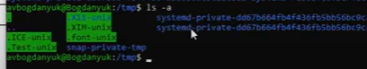{#fig:004 width=70%}

Использую ls -alF. Так я вижу и скрытые файлы, и право доступа, и дату последней ревизии (рис. 5).

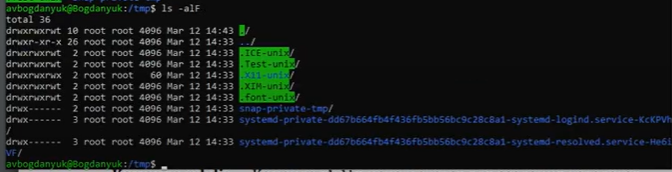{#fig:005 width=70%}

Перехожу в каталог /var/spool, с помощью ls определяю наличие cron. Он там есть (рис. 6).

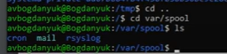{#fig:006 width=70%}

Перехожу в домашний каталог. Смотрю его содержимое (рис. 7).

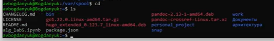{#fig:007 width=70%}

С помощью ls -l определяю владельца файлов и подкаталогов. Это avbogdanyuk (рис. 8).

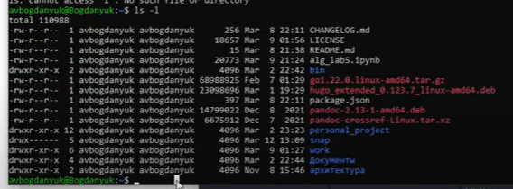{#fig:008 width=70%}

Теперь в домашнем каталоге создаю newdir с помощью mkdir (make direcroty) (рис. 9).

{#fig:009 width=70%}

В каталоге newdir создаю новый каталог morefun (рис. 10).

{#fig:010 width=70%}

С помощью одной команды создаю в домашнем каталоге 3 новых каталога, затем удаляю их разом (рис. 11).

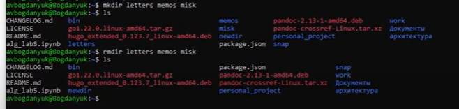{#fig:011 width=70%}

Пробую удалить newdir  с помощью rm, однако у меня не получается, т.к. newdir - это каталог (рис. 12).

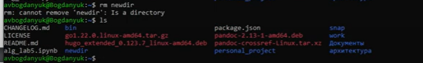{#fig:012 width=70%}

Удаляю morefun, находясь в домашнем каталоге. Он действительно был удален (рис. 13).

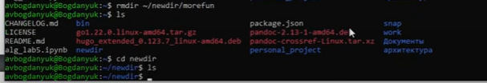{#fig:013 width=70%}

С помощью команды man смотрю manual команды ls (рис. 14).

{#fig:014 width=70%}

Использую ls -R, чтобы посмотреть не только содержмое каталога, в котором я нахожусь, но и содержимое подкаталогов (рис. 15).

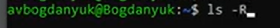{#fig:015 width=70%}

Вывод команды ls -R (рис. 16).

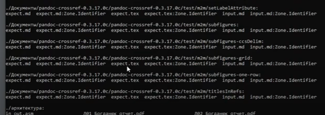{#fig:016 width=70%}

Смотрю справочник cd, однако его не существует (рис. 17).

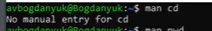{#fig:017 width=70%}

Справочник pwd. Используется для вывода имени текущей директории (рис. 18).

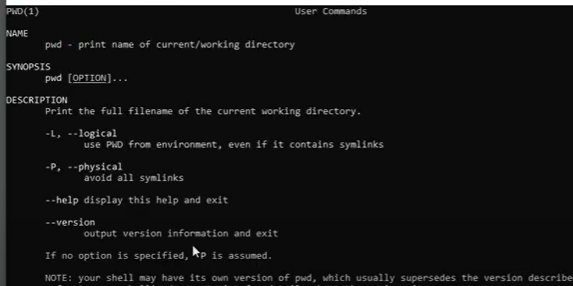{#fig:018 width=70%}

Справочник mkdir. Используется для создания каталогов (рис. 19).

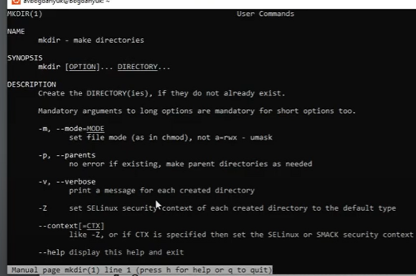{#fig:019 width=70%}

Справочник rmdir. Используется для удаления пустых каталогов (рис. 20).

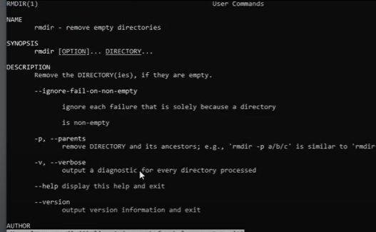{#fig:020 width=70%}

Справочник rm. Используется для удаления файлов и директорий (рис. 21).

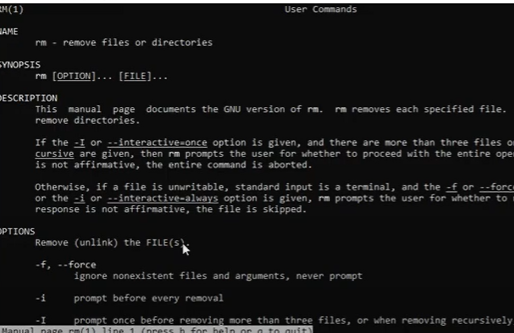{#fig:021 width=70%}

Использую команду history. Используется для просмотра истории действий (рис. 22).

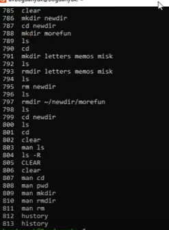{#fig:022 width=70%}

Для того, чтобы отсортировать по времени последнего изменения выводимый список содержимого каталогоа с развернутым описание файлов, использую ls -R -t (рис. 23).

{#fig:023 width=70%}

Вывод ls -R -t (рис. 24).

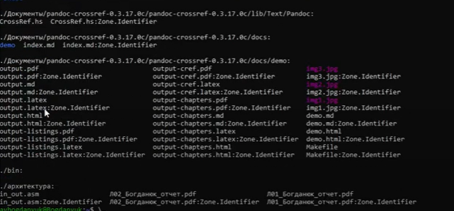{#fig:024 width=70%}

Модифицирую историю действий, заменяю одно на другое (рис. 25).

{#fig:025 width=70%}

# Выводы

В ходе выполнения лабораторной работы были приобретены практические навыки взаимодействия пользователя с системой посредством командной строки.