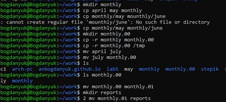

---
## Front matter
lang: ru-RU
title: Лабораторная работа №7
subtitle: Операционные системы
author:
  - Богданюк А.В., НКАбд-01-23
institute:
  - Российский университет дружбы народов, Москва, Россия
date: 09 марта 2024

## i18n babel
babel-lang: russian
babel-otherlangs: english

## Formatting pdf
toc: false
toc-title: Содержание
slide_level: 2
aspectratio: 169
section-titles: true
theme: metropolis
header-includes:
 - \metroset{progressbar=frametitle,sectionpage=progressbar,numbering=fraction}
 - '\makeatletter'
 - '\beamer@ignorenonframefalse'
 - '\makeatother'
---

## Цель работы

Ознакомление с файловой системой Linux, её структурой, именами и содержанием каталогов. Приобретение практических навыков по применению команд для работы с файлами и каталогами, по управлению процессами (и работами), по проверке использования диска и обслуживанию файловой системы.

## Задание

1. Команды для работы с файлами и каталогами
2. Копирование файлов и каталогов
3. Перемещение и переименование файлов и каталогов
4. Права доступа
5. Изменение прав доступа
6. Анализ файловой системы

## Выполнение лабораторной работы

Для начала создаю файл abc1, затем копирую его с именами april и may. Создаю директорию monthly, копирую ранее созданые файлы в этот каталог.(рис. 1).

{#fig:001 width=70%}

## Выполнение лабораторной работы

Затем создаю каталог monthly.00, рекурсивно копирую его, перемещаю файлы из одной директории в другую. Делаю все по образцу (рис. 2).

{#fig:002 width=70%}

## Выполнение лабораторной работы

Теперь создаю еще директории, копирую туда ранее созданые файлы (рис. 3).

{#fig:003 width=70%}

## Выполнение лабораторной работы

Затем создаю файл may, смотрю с помощью chmod права доступа разных пользователей, изменяю права для чтения (рис. 4).

{#fig:004 width=70%}

## Выполнение лабораторной работы

Начинаю выполнять основню часть лабораторной работы. Копирую файл endian.h под именем equipment(рис. 5).

{#fig:005 width=70%}

## Выполнение лабораторной работы

Создаю директорию ski.plases, перемещаю туда ранее скопированый файл, проверяю их наличие (рис. 6).

{#fig:006 width=70%}

## Выполнение лабораторной работы

Переименовываю файл equipment  в equiplist, abc1 в equiplist2(рис. 7).

{#fig:007 width=70%}

## Выполнение лабораторной работы

Создаю newdir, переименовываю его в plans, перемещаю в ski/plases (рис. 8).

{#fig:008 width=70%}

## Выполнение лабораторной работы

Теперь создаю 4 новых файла с помощью touch и меняю им права доступа на те, которые требовались в задании (рис. 9).

{#fig:009 width=70%}

## Выполнение лабораторной работы

Перехожу в etc и смотрю файл passwd, т.к. файла password  у меня не было (рис. 10).

{#fig:010 width=70%}

## Выполнение лабораторной работы

Копирую файл feathers  в file.old (рис. 11).

{#fig:011 width=70%}

## Выполнение лабораторной работы

Создаю новые каталоги и перемещаю их (рис. 12).

{#fig:012 width=70%}

## Выполнение лабораторной работы

Теперь изменяю права доступа файла feathers так, чтобы я не могла его прочитать, проверяю, и действительно не получается (рис. 13).

{#fig:013 width=70%}

## Выполнение лабораторной работы

Директорию play запрещаю импользовать себе, пытаю перейти, у меня не получается. Затем возвращаю право на использование, могу перейти (рис. 14).

{#fig:014 width=70%}

## Выполнение лабораторной работы

Смотрю мануалы функций mount (для монтирования файловой системы), fsck (проверить и починить файловую систему Линукс, mkfs (постоить файловую систему), kill (отправить сигнал процессу) (рис. 15).

{#fig:015 width=70%}

## Вывод

В ходе выполнения лабораторной работы я ознакомилась с файловой системой Linux, её структурой, именами и содержанием каталогов. Приобрела практические навыки по применению команд для работы с файлами и каталогами, по управлению процессами (и работами), по проверке использования диска и обслуживанию файловой системы.

## Список литературы{.unnumbered}

::: {#refs}
1. Dash P. Getting started with oracle vm virtualbox. Packt Publishing Ltd, 2013. 86 p.
2. Colvin H. Virtualbox: An ultimate guide book on virtualization with virtualbox. CreateSpace Independent Publishing Platform, 2015. 70 p.
3. van Vugt S. Red hat rhcsa/rhce 7 cert guide : Red hat enterprise linux 7 (ex200 and ex300). Pearson IT Certification, 2016. 1008 p.
4. Робачевский А., Немнюгин С., Стесик О. Операционная система unix. 2-е изд. Санкт-Петербург: БХВ-Петербург, 2010. 656 p.
5. Немет Э. et al. Unix и Linux: руководство системного администратора. 4-е изд. Вильямс, 2014. 1312 p.
6. Колисниченко Д.Н. Самоучитель системного администратора Linux. СПб.: БХВ-Петербург, 2011. 544 p.
7. Robbins A. Bash pocket reference. O’Reilly Media, 2016. 156 p.
:::