---
## Front matter
title: "Лабораторная работа 7"
subtitle: "Операционные системы"
author: "Богданюк Анна Васильевна"

## Generic otions
lang: ru-RU
toc-title: "Содержание"

## Bibliography
bibliography: bib/cite.bib
csl: pandoc/csl/gost-r-7-0-5-2008-numeric.csl

## Pdf output format
toc: true # Table of contents
toc-depth: 2
lof: true # List of figures
lot: true # List of tables
fontsize: 12pt
linestretch: 1.5
papersize: a4
documentclass: scrreprt
## I18n polyglossia
polyglossia-lang:
  name: russian
  options:
	- spelling=modern
	- babelshorthands=true
polyglossia-otherlangs:
  name: english
## I18n babel
babel-lang: russian
babel-otherlangs: english
## Fonts
mainfont: PT Mono
romanfont: PT Mono
sansfont: PT Mono
monofont: PT Mono
mainfontoptions: Ligatures=TeX
romanfontoptions: Ligatures=TeX
sansfontoptions: Ligatures=TeX,Scale=MatchLowercase
monofontoptions: Scale=MatchLowercase,Scale=0.9
## Biblatex
biblatex: true
biblio-style: "gost-numeric"
biblatexoptions:
  - parentracker=true
  - backend=biber
  - hyperref=auto
  - language=auto
  - autolang=other*
  - citestyle=gost-numeric
## Pandoc-crossref LaTeX customization
figureTitle: "Рис."
tableTitle: "Таблица"
listingTitle: "Листинг"
lofTitle: "Список иллюстраций"
lotTitle: "Список таблиц"
lolTitle: "Листинги"
## Misc options
indent: true
header-includes:
  - \usepackage{indentfirst}
  - \usepackage{float} # keep figures where there are in the text
  - \floatplacement{figure}{H} # keep figures where there are in the text
---

# Цель работы

Ознакомление с файловой системой Linux, её структурой, именами и содержанием каталогов. Приобретение практических навыков по применению команд для работы с файлами и каталогами, по управлению процессами (и работами), по проверке использования диска и обслуживанию файловой системы.

# Задание

1. Команды для работы с файлами и каталогами
2. Копирование файлов и каталогов
3. Перемещение и переименование файлов и каталогов
4. Права доступа
5. Изменение прав доступа
6. Анализ файловой системы

# Выполнение лабораторной работы

Для начала создаю файл abc1, затем копирую его с именами april и may. Создаю директорию monthly, копирую ранее созданые файлы в этот каталог.(рис. 1).

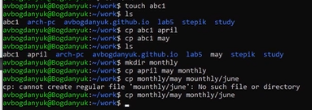{#fig:001 width=70%}

Затем создаю каталог monthly.00, рекурсивно копирую его, перемещаю файлы из одной директории в другую. Делаю все по образцу (рис. 2).

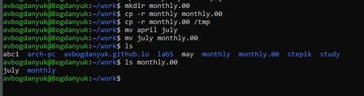{#fig:002 width=70%}

Теперь создаю еще директории, копирую туда ранее созданые файлы (рис. 3).

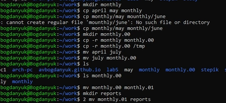{#fig:003 width=70%}

Затем создаю файл may, смотрю с помощью chmod права доступа разных пользователей, изменяю права для чтения (рис. 4).

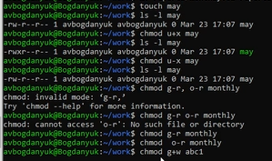{#fig:004 width=70%}

Начинаю выполнять основню часть лабораторной работы. Копирую файл endian.h под именем equipment(рис. 5).

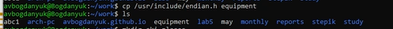{#fig:005 width=70%}

Создаю директорию ski.plases, перемещаю туда ранее скопированый файл, проверяю их наличие (рис. 6).

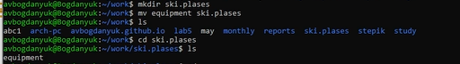{#fig:006 width=70%}

Переименовываю файл equipment  в equiplist, abc1 в equiplist2(рис. 7).

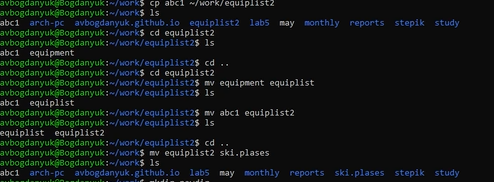{#fig:007 width=70%}

Создаю newdir, переименовываю его в plans, перемещаю в ski/plases (рис. 8).

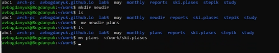{#fig:008 width=70%}

Теперь создаю 4 новых файла с помощью touch и меняю им права доступа на те, которые требовались в задании (рис. 9).

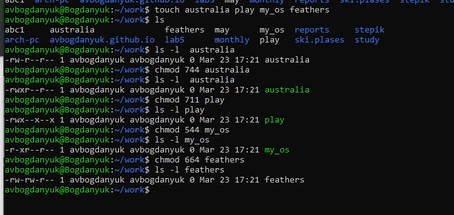{#fig:009 width=70%}

Перехожу в etc и смотрю файл passwd, т.к. файла password  у меня не было (рис. 10).

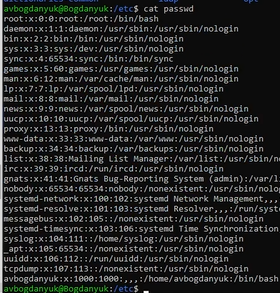{#fig:010 width=70%}

Копирую файл feathers  в file.old (рис. 11).

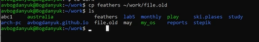{#fig:011 width=70%}

Создаю новые каталоги и перемещаю их (рис. 12).

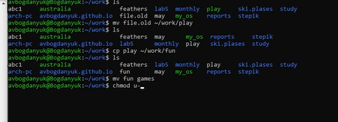{#fig:012 width=70%}

Теперь изменяю права доступа файла feathers так, чтобы я не могла его прочитать, проверяю, и действительно не получается (рис. 13).

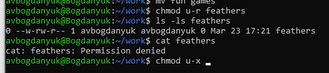{#fig:013 width=70%}

Директорию play запрещаю импользовать себе, пытаю перейти, у меня не получается. Затем возвращаю право на использование, могу перейти (рис. 14).

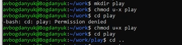{#fig:014 width=70%}

Смотрю мануалы функций mount (для монтирования файловой системы), fsck (проверить и починить файловую систему Линукс, mkfs (постоить файловую систему), kill (отправить сигнал процессу) (рис. 15).

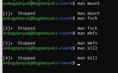{#fig:015 width=70%}

# Выводы

В ходе выполнения лабораторной работы я ознакомилась с файловой системой Linux, её структурой, именами и содержанием каталогов. Приобрела практические навыки по применению команд для работы с файлами и каталогами, по управлению процессами (и работами), по проверке использования диска и обслуживанию файловой системы.