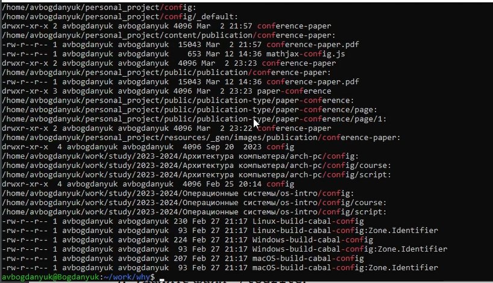
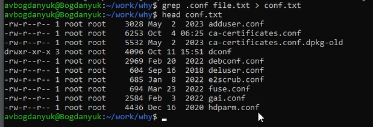
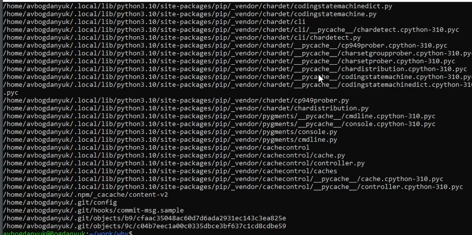
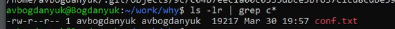
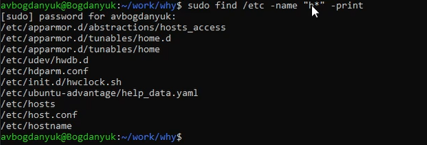
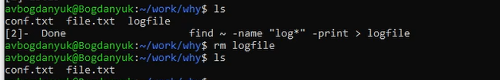
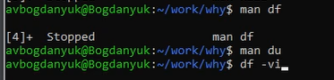
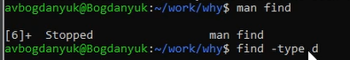

---
## Front matter
lang: ru-RU
title: Лабораторная работа №8
subtitle: Операционные системы
author:
  - Богданюк А.В., НКАбд-01-23
institute:
  - Российский университет дружбы народов, Москва, Россия
date: 09 марта 2024

## i18n babel
babel-lang: russian
babel-otherlangs: english

## Formatting pdf
toc: false
toc-title: Содержание
slide_level: 2
aspectratio: 169
section-titles: true
theme: metropolis
header-includes:
 - \metroset{progressbar=frametitle,sectionpage=progressbar,numbering=fraction}
 - '\makeatletter'
 - '\beamer@ignorenonframefalse'
 - '\makeatother'
---

## Цель работы
Ознакомление с инструментами поиска файлов и фильтрации текстовых данных. Приобретение практических навыков: по управлению процессами (и заданиями), по проверке использования диска и обслуживанию файловых систем.

## Задание

1. Перенаправление ввода-вывода
2. Конвейер
3. Поиск текста
4. Фильтрация текста
5. Проверка использования диска
6. Управление задачами
7. Управление процессами

## Теоретическое введение

Команда find используется для поиска и отображения на экран имён файлов, соответствующих заданной строке символов.
Найти в текстовом файле указанную строку символов позволяет команда grep.
Команда df показывает размер каждого смонтированного раздела диска.
Любую выполняющуюся в консоли команду или внешнюю программу можно запустить в фоновом режиме. Для этого следует в конце имени команды указать знак амперсанда &. 
Любой команде, выполняемой в системе, присваивается идентификатор процесса (process ID). Получить информацию о процессе и управлять им, пользуясь идентификатором процесса, можно из любого окна командного интерпретатора

## Выполнение лабораторной работы

Осуществляю вход в систему, используя соответствующее имя пользователя. Записываю в файл file.txt названия файлов, содержащихся в каталоге /etc. Проверяю, все сработало (рис. 1).

{#fig:001 width=70%}

## Выполнение лабораторной работы

Затем дописываю в этот же файл названия файлов, содержащихся в вашем домашнем каталоге (рис. 2).

{#fig:002 width=70%}

## Выполнение лабораторной работы

Теперь вывожу имена всех файлов из file.txt, имеющих расширение .conf (рис. 3).

{#fig:003 width=70%}

## Выполнение лабораторной работы

Вывод всех файлов с расширение .conf (рис. 4).

{#fig:004 width=70%}

## Выполнение лабораторной работы

После чего записываю их в новый текстовой файл conf.txt. (рис. 5).

{#fig:005 width=70%}

## Выполнение лабораторной работы

Определяю, какие файлы в моем домашнем каталоге имеют имена, начинавшиеся с символа c(рис. 6).

{#fig:006 width=70%}

## Выполнение лабораторной работы

Файлы в моем домашнем каталоге имеют имена, начинавшиеся с символа c (рис. 7).

{#fig:007 width=70%}

## Выполнение лабораторной работы

Определяю, какие файлы в моем домашнем каталоге имеют имена, начинавшиеся с символа c (рис. 8).

{#fig:008 width=70%}

## Выполнение лабораторной работы

Вывожу на экран (по странично) имена файлов из каталога /etc, начинающиеся с символа h. (рис. 9).

{#fig:009 width=70%}

## Выполнение лабораторной работы

Запускаю в фоновом режиме процесс, который будет записывать в файл ~/logfile файлы, имена которых начинаются с log. (рис. 10).

{#fig:010 width=70%}

## Выполнение лабораторной работы

Удаляю файл ~/work/why/logfile (рис. 11).

{#fig:011 width=70%}

## Выполнение лабораторной работы

Запустите из консоли в фоновом режиме редактор nano (рис. 12).

{#fig:012 width=70%}

## Выполнение лабораторной работы

Использую kill для завершения процесса nano (рис. 13).

{#fig:013 width=70%}

## Выполнение лабораторной работы

Выполняю команду df, предварительно получив более подробную информацию об этой команде, с помощью команды man (рис. 14).

{#fig:014 width=70%}

## Выполнение лабораторной работы

Выполняю команду du, предварительно получив более подробную информацию об этой команде, с помощью команды man (рис. 15).

{#fig:015 width=70%}

## Выполнение лабораторной работы

Воспользовавшись справкой команды find, вывожу имена всех директорий, имеющихся в моем домашнем каталоге (рис. 16).

{#fig:016 width=70%}

## Выводы

В ходе выполнения лабораторной работы была ознакомлена с инструментами поиска файлов и фильтрации текстовых данных. Были приобретены практические навыки: по управлению процессами (и заданиями), по проверке использования диска и обслуживанию файловых систем.

## Список литературы{.unnumbered}

::: {#refs}
1. Dash P. Getting started with oracle vm virtualbox. Packt Publishing Ltd, 2013. 86 p.
2. Colvin H. Virtualbox: An ultimate guide book on virtualization with virtualbox. CreateSpace Independent Publishing Platform, 2015. 70 p.
3. van Vugt S. Red hat rhcsa/rhce 7 cert guide : Red hat enterprise linux 7 (ex200 and ex300). Pearson IT Certification, 2016. 1008 p.
4. Робачевский А., Немнюгин С., Стесик О. Операционная система unix. 2-е изд. Санкт-Петербург: БХВ-Петербург, 2010. 656 p.
5. Немет Э. et al. Unix и Linux: руководство системного администратора. 4-е изд. Вильямс, 2014. 1312 p.
6. Колисниченко Д.Н. Самоучитель системного администратора Linux. СПб.: БХВ-Петербург, 2011. 544 p.
7. Robbins A. Bash pocket reference. O’Reilly Media, 2016. 156 p.
:::