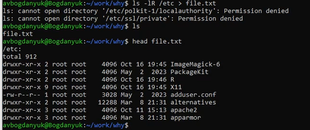
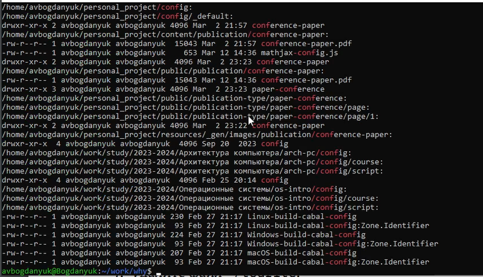
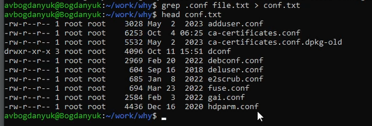
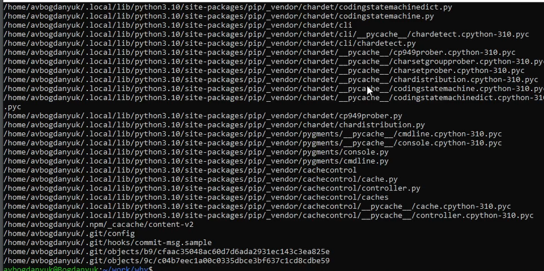
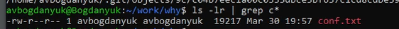
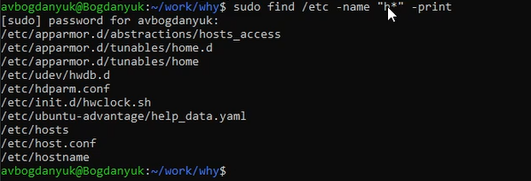
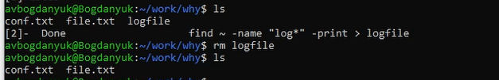
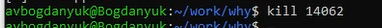
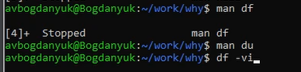
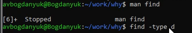

---
## Front matter
title: "Лабораторная работа 8"
subtitle: "Операционные системы"
author: "Богданюк Анна Васильевна"

## Generic otions
lang: ru-RU
toc-title: "Содержание"

## Bibliography
bibliography: bib/cite.bib
csl: pandoc/csl/gost-r-7-0-5-2008-numeric.csl

## Pdf output format
toc: true # Table of contents
toc-depth: 2
lof: true # List of figures
lot: true # List of tables
fontsize: 12pt
linestretch: 1.5
papersize: a4
documentclass: scrreprt
## I18n polyglossia
polyglossia-lang:
  name: russian
  options:
	- spelling=modern
	- babelshorthands=true
polyglossia-otherlangs:
  name: english
## I18n babel
babel-lang: russian
babel-otherlangs: english
## Fonts
mainfont: PT Mono
romanfont: PT Mono
sansfont: PT Mono
monofont: PT Mono
mainfontoptions: Ligatures=TeX
romanfontoptions: Ligatures=TeX
sansfontoptions: Ligatures=TeX,Scale=MatchLowercase
monofontoptions: Scale=MatchLowercase,Scale=0.9
## Biblatex
biblatex: true
biblio-style: "gost-numeric"
biblatexoptions:
  - parentracker=true
  - backend=biber
  - hyperref=auto
  - language=auto
  - autolang=other*
  - citestyle=gost-numeric
## Pandoc-crossref LaTeX customization
figureTitle: "Рис."
tableTitle: "Таблица"
listingTitle: "Листинг"
lofTitle: "Список иллюстраций"
lotTitle: "Список таблиц"
lolTitle: "Листинги"
## Misc options
indent: true
header-includes:
  - \usepackage{indentfirst}
  - \usepackage{float} # keep figures where there are in the text
  - \floatplacement{figure}{H} # keep figures where there are in the text
---

# Цель работы

Ознакомление с инструментами поиска файлов и фильтрации текстовых данных. Приобретение практических навыков: по управлению процессами (и заданиями), по проверке использования диска и обслуживанию файловых систем.

# Задание

1. Перенаправление ввода-вывода
2. Конвейер
3. Поиск текста
4. Фильтрация текста
5. Проверка использования диска
6. Управление задачами
7. Управление процессами

# Теоретическое введение

Команда find используется для поиска и отображения на экран имён файлов, соответствующих заданной строке символов.
Найти в текстовом файле указанную строку символов позволяет команда grep.
Команда df показывает размер каждого смонтированного раздела диска.
Любую выполняющуюся в консоли команду или внешнюю программу можно запустить в фоновом режиме. Для этого следует в конце имени команды указать знак амперсанда &. 
Любой команде, выполняемой в системе, присваивается идентификатор процесса (process ID). Получить информацию о процессе и управлять им, пользуясь идентификатором процесса, можно из любого окна командного интерпретатора

# Выполнение лабораторной работы

Осуществляю вход в систему, используя соответствующее имя пользователя. Записываю в файл file.txt названия файлов, содержащихся в каталоге /etc. Проверяю, все сработало (рис. 1).

{#fig:001 width=70%}

Затем дописываю в этот же файл названия файлов, содержащихся в вашем домашнем каталоге (рис. 2).

{#fig:002 width=70%}

Теперь вывожу имена всех файлов из file.txt, имеющих расширение .conf (рис. 3).

{#fig:003 width=70%}

Вывод всех файлов с расширение .conf (рис. 4).

{#fig:004 width=70%}

После чего записываю их в новый текстовой файл conf.txt. (рис. 5).

{#fig:005 width=70%}

Определяю, какие файлы в моем домашнем каталоге имеют имена, начинавшиеся с символа c(рис. 6).

{#fig:006 width=70%}

Файлы в моем домашнем каталоге имеют имена, начинавшиеся с символа c (рис. 7).

{#fig:007 width=70%}

Определяю, какие файлы в моем домашнем каталоге имеют имена, начинавшиеся с символа c (рис. 8).

{#fig:008 width=70%}

Вывожу на экран (по странично) имена файлов из каталога /etc, начинающиеся с символа h. (рис. 9).

{#fig:009 width=70%}

Запускаю в фоновом режиме процесс, который будет записывать в файл ~/logfile файлы, имена которых начинаются с log. (рис. 10).

{#fig:010 width=70%}

Удаляю файл ~/work/why/logfile (рис. 11).

{#fig:011 width=70%}

Запустите из консоли в фоновом режиме редактор nano (рис. 12).

{#fig:012 width=70%}

Использую kill для завершения процесса nano (рис. 13).

{#fig:013 width=70%}

Выполняю команду df, предварительно получив более подробную информацию об этой команде, с помощью команды man (рис. 14).

{#fig:014 width=70%}

Выполняю команду du, предварительно получив более подробную информацию об этой команде, с помощью команды man (рис. 15).

{#fig:015 width=70%}

Воспользовавшись справкой команды find, вывожу имена всех директорий, имеющихся в моем домашнем каталоге (рис. 16).

{#fig:016 width=70%}

# Выводы

В ходе выполнения лабораторной работы была ознакомлена с инструментами поиска файлов и фильтрации текстовых данных. Были приобретены практические навыки: по управлению процессами (и заданиями), по проверке использования диска и обслуживанию файловых систем.
