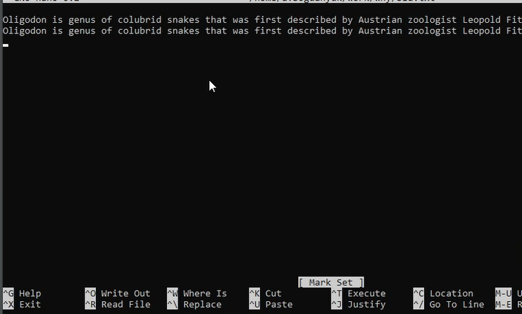
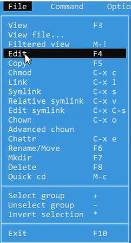
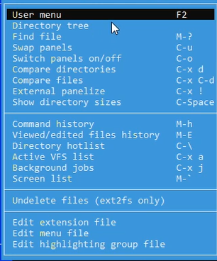
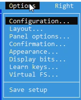
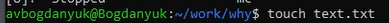
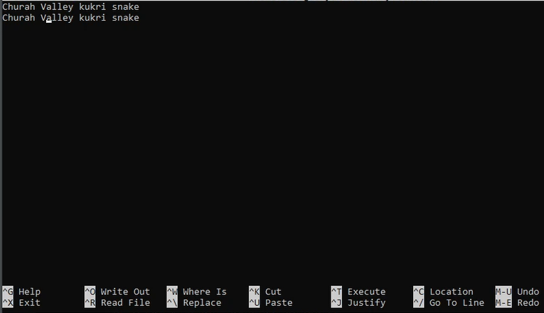
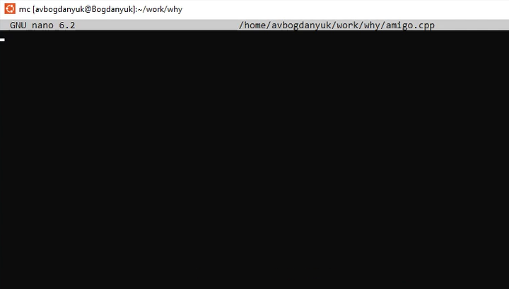

---
## Front matter
lang: ru-RU
title: Лабораторная работа №9
subtitle: Операционные системы
author:
  - Богданюк А.В., НКАбд-01-23
institute:
  - Российский университет дружбы народов, Москва, Россия
date: 09 марта 2024

## i18n babel
babel-lang: russian
babel-otherlangs: english

## Formatting pdf
toc: false
toc-title: Содержание
slide_level: 2
aspectratio: 169
section-titles: true
theme: metropolis
header-includes:
 - \metroset{progressbar=frametitle,sectionpage=progressbar,numbering=fraction}
 - '\makeatletter'
 - '\beamer@ignorenonframefalse'
 - '\makeatother'
---

## Цель работы

Освоение основных возможностей командной оболочки Midnight Commander. Приобретение навыков практической работы по просмотру каталогов и файлов; манипуляций с ними.

## Задание

1. Задание по mc

## Выполнение лабораторной работы

Изучаю информацию о  mc, для этого захожу в справочник по команде man mc (рис. 1).

{#fig:001 width=70%}

## Выполнение лабораторной работы

Затем запускаю midnight commander. Создаю текстовый файл и добавляю туда текст о змеях. Использую все предложеные операции (операции с панелями; выделение/отмена выделения файлов, копирование/перемещение файлов, получение информации о размере и правах доступа на файлы и/или каталоги и т.п.)(рис. 2).

{#fig:002 width=70%}

## Выполнение лабораторной работы

Использую возможности подменю File (рис. 3).

{#fig:003 width=70%}

## Выполнение лабораторной работы

Затем использую возможности подменю Command (рис. 4).

{#fig:004 width=70%}

## Выполнение лабораторной работы

Затем использую возможности подменю Option (рис. 5).

{#fig:005 width=70%}

## Выполнение лабораторной работы

Создаю файл с именем text.txt (рис. 6).

{#fig:006 width=70%}

## Выполнение лабораторной работы

Вставляю в файл текст о змеях и удаляю строку, и виделяю фрагемент текста, и копирую его на новую строку и так далее (рис. 7).

{#fig:007 width=70%}

## Выполнение лабораторной работы

Создаю файл с именем amigo.cpp, т.е. файл с программой на языке C++. Изменяю его (рис. 8).

{#fig:008 width=70%}

## Вывод

В ходе выполнения лабораторной работы были освоены основные возможности командной оболочки Midnight Commander. Приобретены навыки практической работы по просмотру каталогов и файлов; манипуляций с ними.

## Список литературы{.unnumbered}

::: {#refs}
1. Dash P. Getting started with oracle vm virtualbox. Packt Publishing Ltd, 2013. 86 p.
2. Colvin H. Virtualbox: An ultimate guide book on virtualization with virtualbox. CreateSpace Independent Publishing Platform, 2015. 70 p.
3. van Vugt S. Red hat rhcsa/rhce 7 cert guide : Red hat enterprise linux 7 (ex200 and ex300). Pearson IT Certification, 2016. 1008 p.
4. Робачевский А., Немнюгин С., Стесик О. Операционная система unix. 2-е изд. Санкт-Петербург: БХВ-Петербург, 2010. 656 p.
5. Немет Э. et al. Unix и Linux: руководство системного администратора. 4-е изд. Вильямс, 2014. 1312 p.
6. Колисниченко Д.Н. Самоучитель системного администратора Linux. СПб.: БХВ-Петербург, 2011. 544 p.
7. Robbins A. Bash pocket reference. O’Reilly Media, 2016. 156 p.
:::