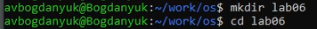
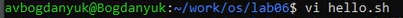
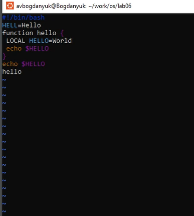
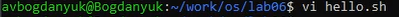
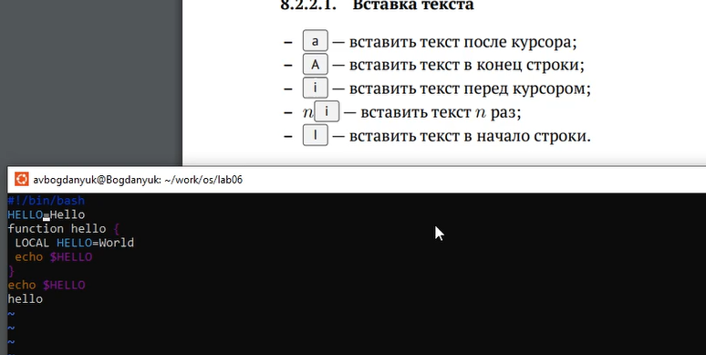
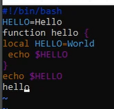
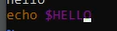

---
## Front matter
lang: ru-RU
title: Лабораторная работа №10
subtitle: Операционные системы
author:
  - Богданюк А.В., НКАбд-01-23
institute:
  - Российский университет дружбы народов, Москва, Россия
date: 09 марта 2024

## i18n babel
babel-lang: russian
babel-otherlangs: english

## Formatting pdf
toc: false
toc-title: Содержание
slide_level: 2
aspectratio: 169
section-titles: true
theme: metropolis
header-includes:
 - \metroset{progressbar=frametitle,sectionpage=progressbar,numbering=fraction}
 - '\makeatletter'
 - '\beamer@ignorenonframefalse'
 - '\makeatother'
---

## Цель работы

Познакомиться с операционной системой Linux. Получить практические навыки работы с редактором vi, установленным по умолчанию практически во всех дистрибутивах.

## Задание

1. Ознакомиться с теоретическим материалом.
2. Ознакомиться с редактором vi.
3. Выполнить упражнения, используя команды vi.

## Теоретическое введение

В большинстве дистрибутивов Linux в качестве текстового редактора по умолчанию
устанавливается интерактивный экранный редактор vi (Visual display editor).
Редактор vi имеет три режима работы:
– командный режим — предназначен для ввода команд редактирования и навигации по
редактируемому файлу;
– режим вставки — предназначен для ввода содержания редактируемого файла;
– режим последней (или командной) строки — используется для записи изменений в файл
и выхода из редактора.

## Выполнение лабораторной работы

Создаю каталог ~/work/os/lab06 и перехожу в него (рис. 1).

{#fig:001 width=70%}

## Выполнение лабораторной работы

Затем вызываю vi и создаю файл hello.sh (рис. 2).

{#fig:002 width=70%}

## Выполнение лабораторной работы

Теперь нажимаю клавишу i и ввожу текст из лабораторной работа. Затем нажимаю Esc для перехода в командный режим. Далее сохраняю изменения в файле, выхожу (рис. 3).

{#fig:003 width=70%}

## Выполнение лабораторной работы

Делаю файл hello.sh исполняемым (рис. 4).

{#fig:004 width=70%}

## Выполнение лабораторной работы

Теперь вызываю vi для редактирования существующего файла hello.sh (рис. 5).

{#fig:005 width=70%}

## Выполнение лабораторной работы

Для того чтобы вставить текст после курсора, нажимаю английскую а в нижнем регистре. Изменяю HELL на HELLO (рис. 6).

{#fig:006 width=70%}

## Выполнение лабораторной работы

Убираю LOCAL. Вместо него пишу local (рис. 7).

{#fig:007 width=70%}

## Выполнение лабораторной работы

В конце пишу echo %HELLO. Сохраняю текст и выхожу (рис. 8).

{#fig:008 width=70%}

## Выводы

В ходе выполнения лабораторной работы я познакомилась с операционной системой Linux. Получила практические навыки работы с редактором vi, установленным по умолчанию практически во всех дистрибутивах.

## Список литературы{.unnumbered}

::: {#refs}
1. Dash P. Getting started with oracle vm virtualbox. Packt Publishing Ltd, 2013. 86 p.
2. Colvin H. Virtualbox: An ultimate guide book on virtualization with virtualbox. CreateSpace Independent Publishing Platform, 2015. 70 p.
3. van Vugt S. Red hat rhcsa/rhce 7 cert guide : Red hat enterprise linux 7 (ex200 and ex300). Pearson IT Certification, 2016. 1008 p.
4. Робачевский А., Немнюгин С., Стесик О. Операционная система unix. 2-е изд. Санкт-Петербург: БХВ-Петербург, 2010. 656 p.
5. Немет Э. et al. Unix и Linux: руководство системного администратора. 4-е изд. Вильямс, 2014. 1312 p.
6. Колисниченко Д.Н. Самоучитель системного администратора Linux. СПб.: БХВ-Петербург, 2011. 544 p.
7. Robbins A. Bash pocket reference. O’Reilly Media, 2016. 156 p.
:::