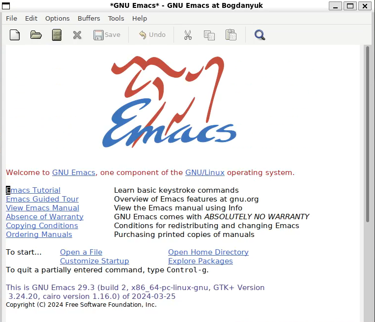
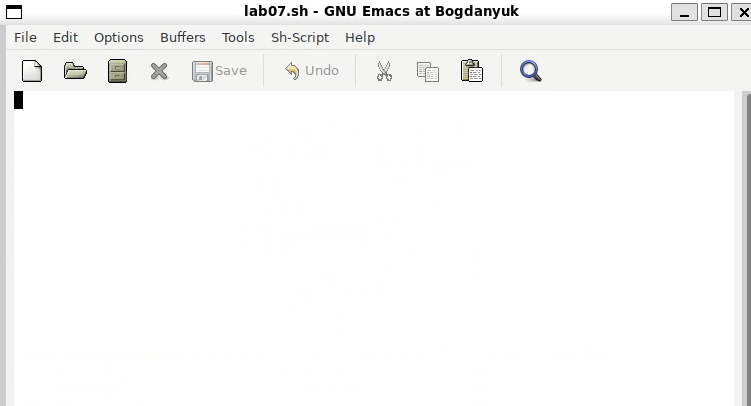
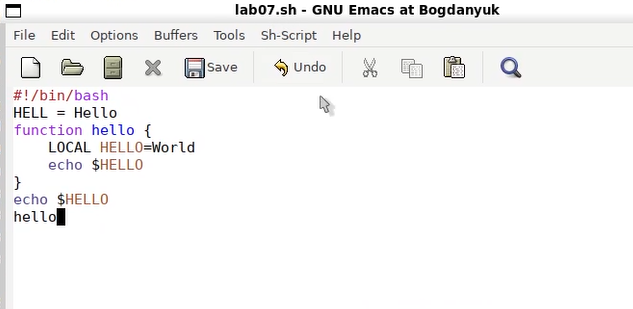
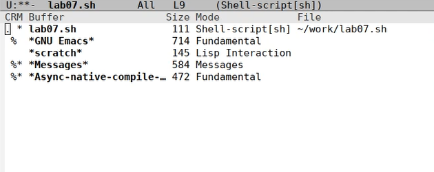
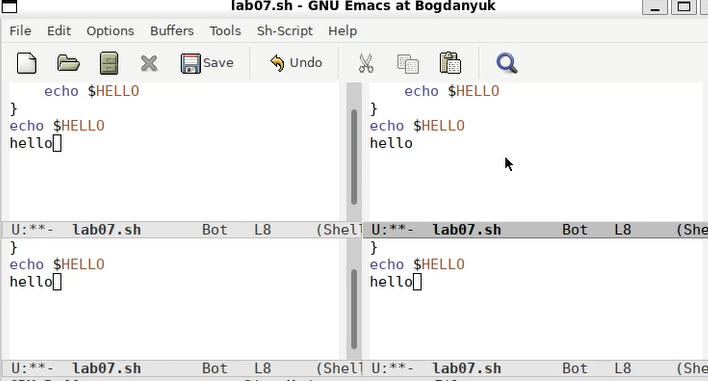
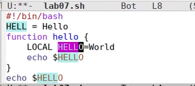

---
## Front matter
lang: ru-RU
title: Лабораторная работа №11
subtitle: Операционные системы
author:
  - Богданюк А.В., НКАбд-01-23
institute:
  - Российский университет дружбы народов, Москва, Россия
date: 09 марта 2024

## i18n babel
babel-lang: russian
babel-otherlangs: english

## Formatting pdf
toc: false
toc-title: Содержание
slide_level: 2
aspectratio: 169
section-titles: true
theme: metropolis
header-includes:
 - \metroset{progressbar=frametitle,sectionpage=progressbar,numbering=fraction}
 - '\makeatletter'
 - '\beamer@ignorenonframefalse'
 - '\makeatother'
---

## Цель работы

Познакомиться с операционной системой Linux. Получить практические навыки работы с редактором Emacs.

## Задание

1. Ознакомиться с теоретическим материалом.
2. Ознакомиться с редактором emacs.
3. Выполнить упражнения.
4. Ответить на контрольные вопросы.

## Теоретическое введение

Буфер — объект, представляющий какой-либо текст.
Каждый фрейм содержит область вывода и одно или несколько окон Emacs.
Окно — прямоугольная область фрейма, отображающая один из буферов.
Каждое окно имеет свою строку состояния, в которой выводится следующая информация: название буфера, его основной режим, изменялся ли текст буфера и как далеко вниз по буферу расположен курсор.
Область вывода — одна или несколько строк внизу фрейма, в которой Emacs выводит различные сообщения, а также запрашивает подтверждения и дополнительную информацию от пользователя.
Минибуфер используется для ввода дополнительной информации и всегда отображается в области вывода.
Точка вставки — место вставки (удаления) данных в буфере.

## Выполнение лабораторной работы

Для начала скачиваю emacs с помощью sudo install emacs --classic, затем пишу в терминале emacs, тем самым запуская его (рис. 1).

{#fig:001 width=70%}

## Выполнение лабораторной работы

Затем создаю файл lab07.sh с помощью комбинации Ctrl-x Ctrl-f(рис. 2).

{#fig:002 width=70%}

## Выполнение лабораторной работы

Теперь набираю текст из описания лабораторной работы. Сохраняю файл с помощью комбинации Ctrl-x Ctrl-s. Вырезаю, копирую и вставляю строки в тексте. Перемещаю курсор в начало и в конец (рис. 3).

{#fig:003 width=70%}

## Выполнение лабораторной работы

Затем вывожу список активных буферов на экран (Ctrl-x Ctrl-b). Перемещаюсь во вновь открытое окно (C-x) o со списком открытых буферов и переключаюсь на другой буфер.(рис. 4).

{#fig:004 width=70%}

## Выполнение лабораторной работы

Делю фрейм на 4 части: разделяю фрейм на два окна по вертикали (C-x 3), а затем каждое из этих окон на две части по горизонтали (C-x 2) (рис. 5).

{#fig:005 width=70%}

## Выполнение лабораторной работы

Переключаюсь в режим поиска и нахожу слово HELL (рис. 6).

{#fig:006 width=70%}

## Вывод

В ходе выполнения лабораторной работы я познакомилась с операционной системой Linux. Получила практические навыки работы с редактором Emacs.

## Список литературы{.unnumbered}

::: {#refs}
1. Dash P. Getting started with oracle vm virtualbox. Packt Publishing Ltd, 2013. 86 p.
2. Colvin H. Virtualbox: An ultimate guide book on virtualization with virtualbox. CreateSpace Independent Publishing Platform, 2015. 70 p.
3. van Vugt S. Red hat rhcsa/rhce 7 cert guide : Red hat enterprise linux 7 (ex200 and ex300). Pearson IT Certification, 2016. 1008 p.
4. Робачевский А., Немнюгин С., Стесик О. Операционная система unix. 2-е изд. Санкт-Петербург: БХВ-Петербург, 2010. 656 p.
5. Немет Э. et al. Unix и Linux: руководство системного администратора. 4-е изд. Вильямс, 2014. 1312 p.
6. Колисниченко Д.Н. Самоучитель системного администратора Linux. СПб.: БХВ-Петербург, 2011. 544 p.
7. Robbins A. Bash pocket reference. O’Reilly Media, 2016. 156 p.
:::