---
## Front matter
lang: ru-RU
title: Индивидульный проект
subtitle: Этап 1
author:
  - Богданюк А.В.
institute:
  - Российский университет дружбы народов, Москва, Россия

## i18n babel
babel-lang: russian
babel-otherlangs: english

## Formatting pdf
toc: false
toc-title: Содержание
slide_level: 2
aspectratio: 169
section-titles: true
theme: metropolis
header-includes:
 - \metroset{progressbar=frametitle,sectionpage=progressbar,numbering=fraction}
 - '\makeatletter'
 - '\beamer@ignorenonframefalse'
 - '\makeatother'
---

# Вводная часть

## Цель

- Научиться размещать сайт на GitHub pages.

## Задачи

1. Установить необходимое программное обеспечение.
2. Скачать шаблон темы сайта.
3. Разместить его на хостинге git.
4. Установить параметр для URLs сайта.
5. Разместить заготовку сайта на Github pages.

# Основная часть

## Выполнение лабораторной работы

Скачиваю последнюю версию hugo с GitHub для Linux (рис. 1).

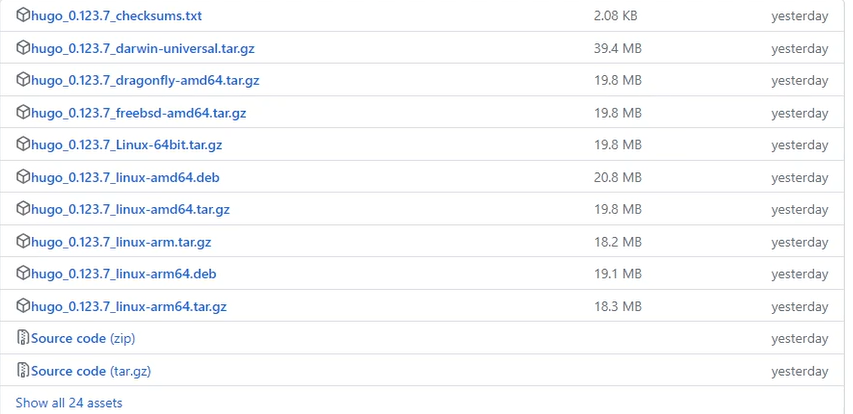{#fig:001 width=70%}

## Выполнение лабораторной работы

Распаковываю архив с Hugo (рис. 2).

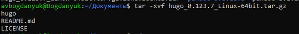{#fig:002 width=70%}

## Выполнение лабораторной работы

Создаю свой репозиторий на основе шаблона темы сайта, затем клонирую его (рис. 3).

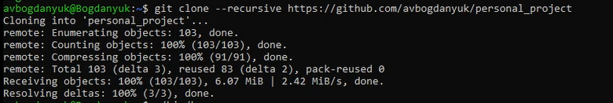{#fig:003 width=70%}

## Выполнение лабораторной работы

Устанавливаю Go (рис. 4).

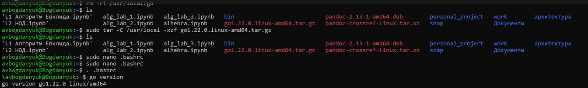{#fig:004 width=70%}

## Выполнение лабораторной работы

Перехожу в репозиторий для индивидульного проекта и запускаю hugo (рис. 5).

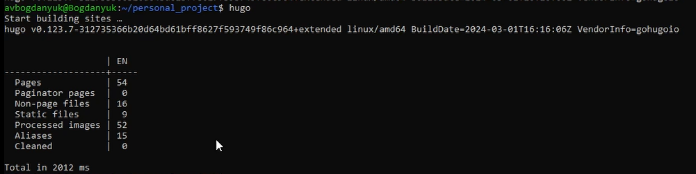{#fig:005 width=70%}

## Выполнение лабораторной работы

Удаляю папку public, так как на данный момент она нам не требуется (рис. 6).

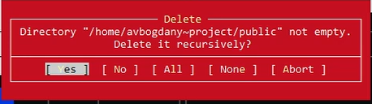{#fig:006 width=70%}

## Выполнение лабораторной работы

Запускаю исполнительный файл с server, получаю страницу сайта на локальном сервере (рис. 7).

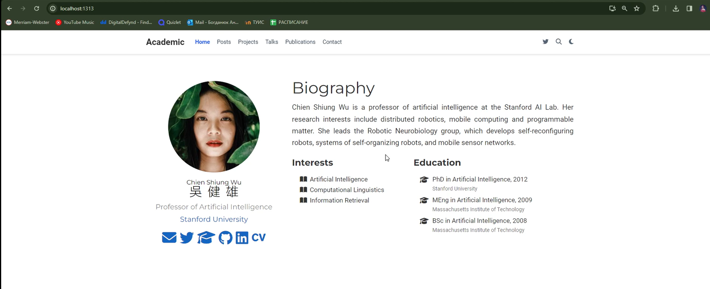{#fig:007 width=70%}

## Выполнение лабораторной работы

Создаю новый репозиторий с именем, совпадающим с названием сайта (рис. 8).

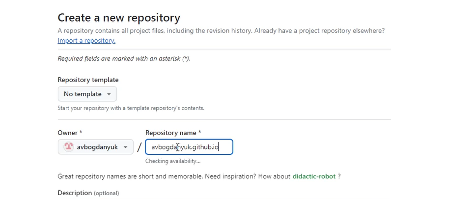{#fig:008 width=70%}

## Выполнение лабораторной работы

Клонирую этот репозиторий, чтобы создать локальный репозиторий у себя на компьютере (рис. 9).

{#fig:009 width=70%}

## Выполнение лабораторной работы

Создаю главную ветку (main) (рис. 10).

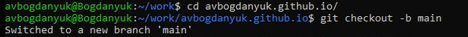{#fig:010 width=70%}

## Выполнение лабораторной работы

Отправляю изменения на сервер (рис. 11).

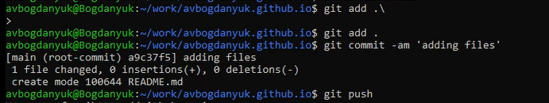{#fig:011 width=70%}

## Выполнение лабораторной работы

Подключаю репозиторий к папке public (рис. 12).

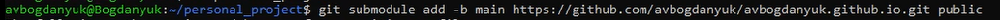{#fig:012 width=70%}

## Выполнение лабораторной работы

Снова запускаю hugo, чтобы заполнить public (рис. 13).

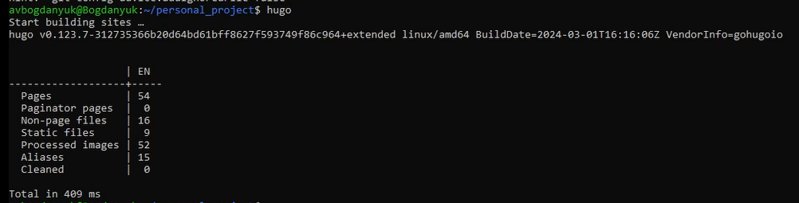{#fig:013 width=70%}

## Выполнение лабораторной работы

Проверяю, чтобы было подключение между public и avbogdanyuk.github.io, затем отправляю изменения на сервер (рис. 14).

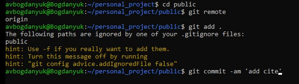{#fig:014 width=70%}

# Заключительная часть

## Вывод

В ходе выполнения первого этапа индивидуального проекта я научилась размещать персональный сайт на GitHub pages.
