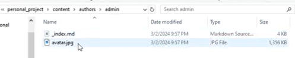
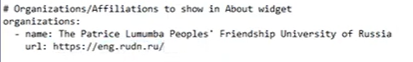
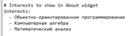
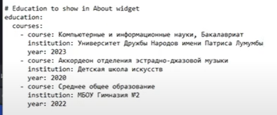
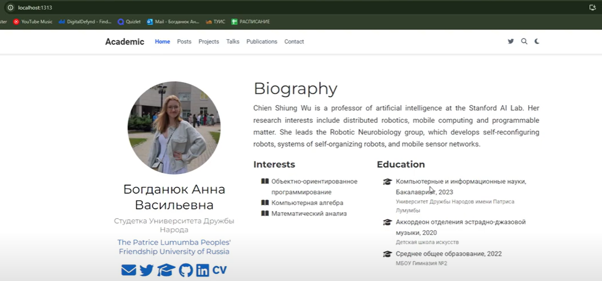
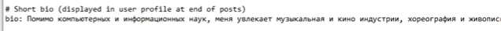
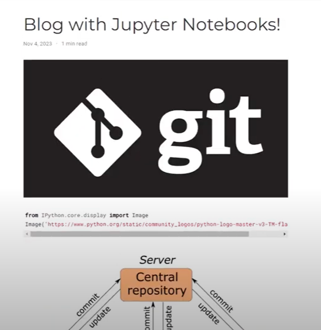
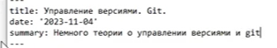
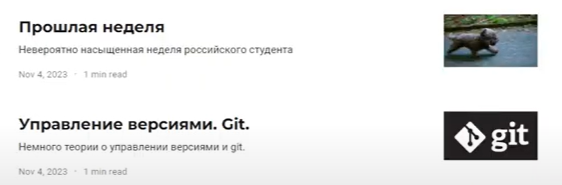

---
## Front matter
lang: ru-RU
title: Индивидуальный проект
subtitle: Этап 2
author:
  - Богданюк А.В., НКАбд-01-23
institute:
  - Российский университет дружбы народов, Москва, Россия
date: 09 марта 2024

## i18n babel
babel-lang: russian
babel-otherlangs: english

## Formatting pdf
toc: false
toc-title: Содержание
slide_level: 2
aspectratio: 169
section-titles: true
theme: metropolis
header-includes:
 - \metroset{progressbar=frametitle,sectionpage=progressbar,numbering=fraction}
 - '\makeatletter'
 - '\beamer@ignorenonframefalse'
 - '\makeatother'
---

## Цель работы

Целью данной работы является добавление информации о владельце на сайт.

## Задание

1. Разместить свою фотографию на сайте
2. Разместить краткое описание владельца
3. Добавить информацию об интересах
4. Добавить информацию об образовании
5. Добавить 2 поста

## Выполнение лабораторной работы

Для начала перехожу в каталог personal_project/content/authors/admin. Затем добавляю свою фотографию avatar.jpg (рис. 1).

{#fig:001 width=70%}

## Выполнение лабораторной работы

Проверяю, подгрузилась ли она. Все работает (рис. 2).

{#fig:002 width=70%}

## Выполнение лабораторной работы

Теперь добавляю информацию об учреждении, в котором я обучаюсь (рис. 3).

{#fig:003 width=70%}

## Выполнение лабораторной работы

Затем пишу о своих интересах (рис. 4).

{#fig:004 width=70%}

## Выполнение лабораторной работы

Далее заполняю информацию о моем образовании (рис. 5).

{#fig:005 width=70%}

## Выполнение лабораторной работы

Вот как на данный момент выглядит мой сайт (рис. 6).

{#fig:006 width=70%}

## Выполнение лабораторной работы

Добавляю краткую биографию (рис. 7).

{#fig:007 width=70%}

## Выполнение лабораторной работы

Перехоже к этапу написания постов. Подгружаю картинки. Я выбрала написать пост об управлении версиями (рис. 8).

{#fig:008 width=70%}

## Выполнение лабораторной работы

Теперь пишу текст для постов (рис. 9).

{#fig:009 width=70%}

## Выполнение лабораторной работы

В итоге на моем сайте есть два поста: прошлая неделя и управление версиями (рис. 10).

{#fig:010 width=70%}

## Вывод

В ходе выполнения 2 этапа индивидуального проекта была добавлена информация на сайт об его владельце.

## Список литературы{.unnumbered}

::: {#refs}
1. Dash P. Getting started with oracle vm virtualbox. Packt Publishing Ltd, 2013. 86 p.
2. Colvin H. Virtualbox: An ultimate guide book on virtualization with virtualbox. CreateSpace Independent Publishing Platform, 2015. 70 p.
3. van Vugt S. Red hat rhcsa/rhce 7 cert guide : Red hat enterprise linux 7 (ex200 and ex300). Pearson IT Certification, 2016. 1008 p.
4. Робачевский А., Немнюгин С., Стесик О. Операционная система unix. 2-е изд. Санкт-Петербург: БХВ-Петербург, 2010. 656 p.
5. Немет Э. et al. Unix и Linux: руководство системного администратора. 4-е изд. Вильямс, 2014. 1312 p.
6. Колисниченко Д.Н. Самоучитель системного администратора Linux. СПб.: БХВ-Петербург, 2011. 544 p.
7. Robbins A. Bash pocket reference. O’Reilly Media, 2016. 156 p.
:::